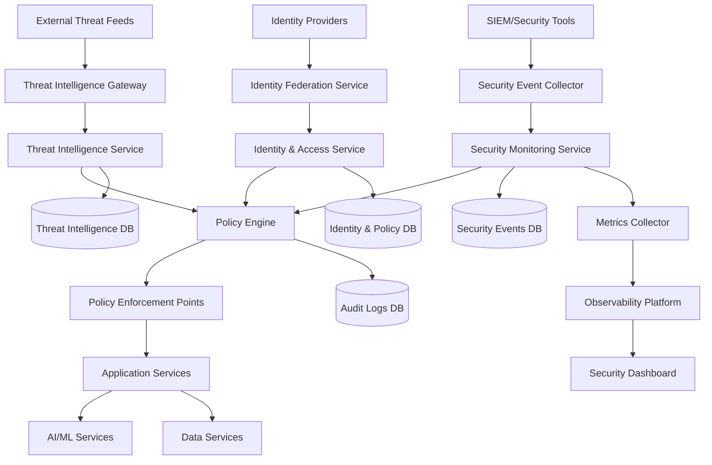
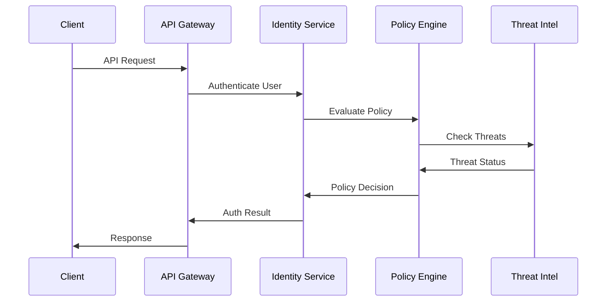
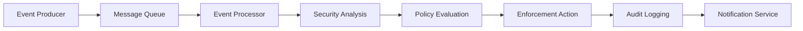
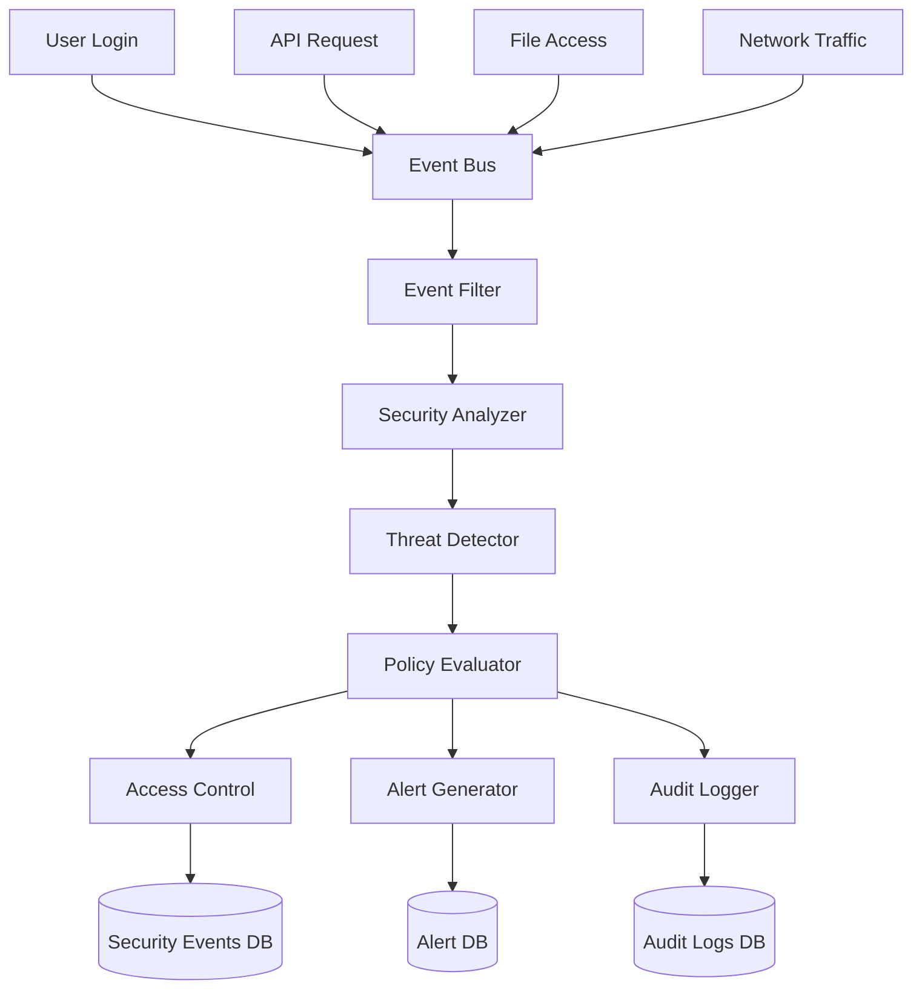
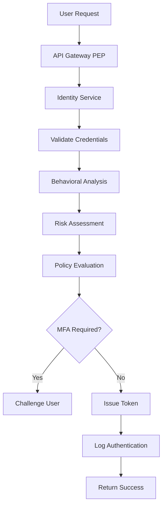
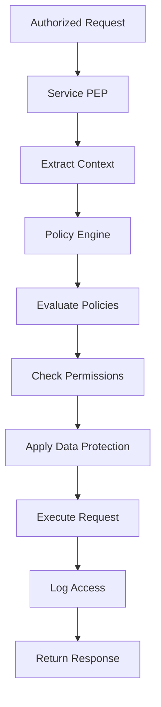
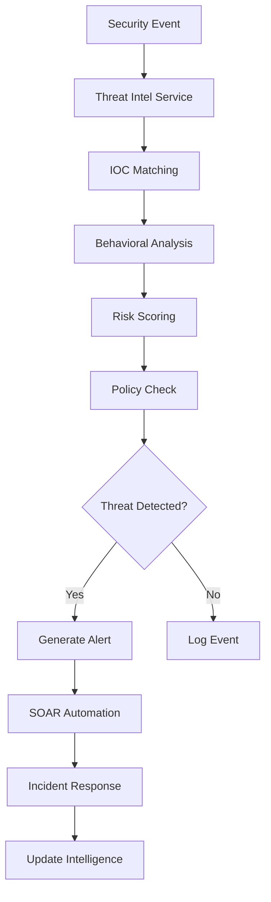
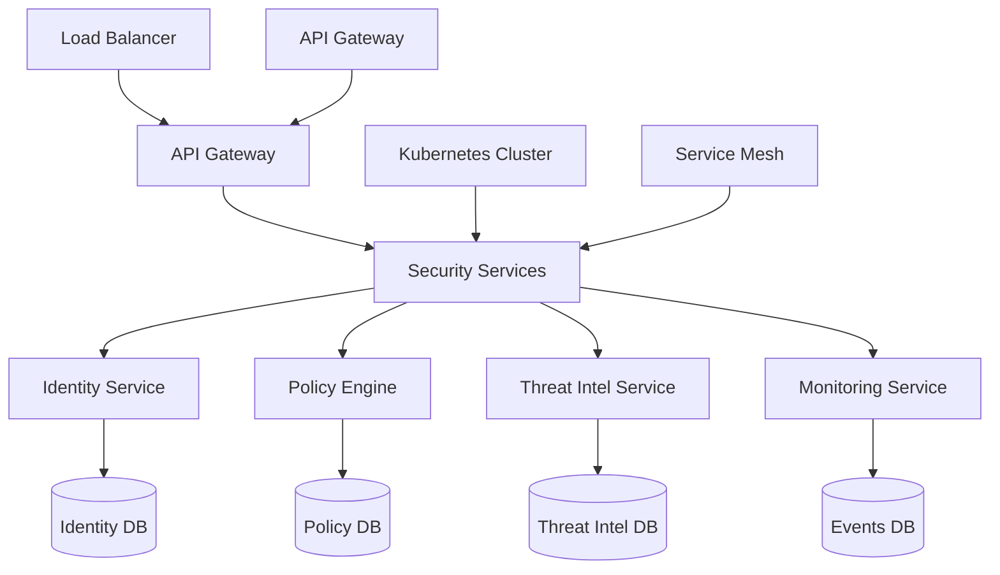
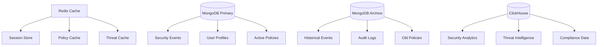
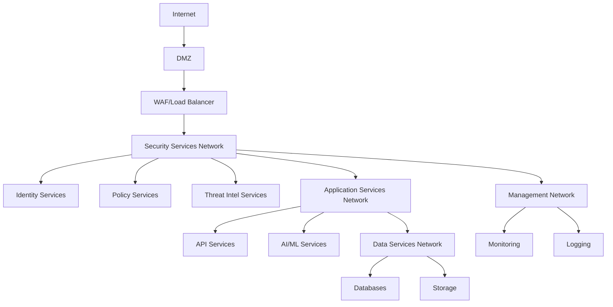

# Zero-Trust Security Component Architecture
## Phase 14.1 - Shin AI Platform

## Overview

This document defines the comprehensive component architecture for the Zero-Trust Security system, including clear service boundaries, interfaces, and interaction patterns. The architecture follows microservices principles with well-defined APIs and event-driven communication.

## System Architecture Overview

### High-Level Architecture


## Component Definitions

### 1. Identity & Access Service (IAS)

**Purpose**: Manages user authentication, authorization, and behavioral analysis

**Interfaces**:
```typescript
interface IIdentityAccessService {
  // Authentication
  authenticate(credentials: Credentials): Promise<AuthResult>;
  validateSession(sessionId: string, behavioralData: BehavioralMetrics): Promise<SessionValidation>;
  refreshSession(sessionId: string): Promise<SessionResult>;

  // Authorization
  authorize(userId: string, resource: Resource, action: string): Promise<AuthorizationResult>;
  checkPermissions(userId: string, permissions: string[]): Promise<PermissionResult>;

  // Behavioral Analysis
  analyzeBehavior(userId: string, metrics: BehavioralMetrics): Promise<BehavioralAnalysis>;
  updateBehavioralProfile(userId: string, patterns: BehavioralPattern[]): Promise<void>;

  // Risk Assessment
  assessRisk(userId: string, context: RiskContext): Promise<RiskAssessment>;
  getRiskScore(userId: string): Promise<number>;
}
```

**Service Boundaries**:
- **Inbound**: REST API, GraphQL, Event streams
- **Outbound**: Database, Cache, Message queues, External IdPs
- **Dependencies**: User service, Organization service, Audit service

### 2. Policy Engine Service (PES)

**Purpose**: Centralized policy evaluation and enforcement decisions

**Interfaces**:
```typescript
interface IPolicyEngineService {
  // Policy Management
  createPolicy(policy: SecurityPolicy): Promise<PolicyResult>;
  updatePolicy(policyId: string, updates: PolicyUpdate): Promise<PolicyResult>;
  deletePolicy(policyId: string): Promise<void>;
  getPolicy(policyId: string): Promise<SecurityPolicy>;

  // Policy Evaluation
  evaluatePolicy(request: PolicyRequest): Promise<PolicyDecision>;
  batchEvaluatePolicies(requests: PolicyRequest[]): Promise<PolicyDecision[]>;
  getEffectivePolicies(userId: string, resource: Resource): Promise<SecurityPolicy[]>;

  // Policy Analytics
  getPolicyMetrics(policyId: string, timeRange: TimeRange): Promise<PolicyMetrics>;
  getPolicyViolations(policyId: string, timeRange: TimeRange): Promise<Violation[]>;
}
```

**Service Boundaries**:
- **Inbound**: REST API, Message queues, Event streams
- **Outbound**: Database, Cache, Audit service
- **Dependencies**: Identity service, Threat intelligence service

### 3. Threat Intelligence Service (TIS)

**Purpose**: Manages threat intelligence feeds and IOC detection

**Interfaces**:
```typescript
interface IThreatIntelligenceService {
  // Feed Management
  addThreatFeed(feed: ThreatFeed): Promise<FeedResult>;
  updateThreatFeed(feedId: string, updates: FeedUpdate): Promise<FeedResult>;
  removeThreatFeed(feedId: string): Promise<void>;
  getThreatFeeds(): Promise<ThreatFeed[]>;

  // IOC Management
  addIOC(indicator: IOC): Promise<IOCResult>;
  searchIOCs(criteria: IOCSearchCriteria): Promise<IOC[]>;
  updateIOCStatus(iocId: string, status: IOCStatus): Promise<void>;

  // Detection
  scanForIOCs(target: ScanTarget): Promise<ScanResult>;
  detectThreats(context: DetectionContext): Promise<ThreatDetection[]>;
  correlateThreats(threats: ThreatDetection[]): Promise<CorrelatedThreats>;
}
```

**Service Boundaries**:
- **Inbound**: REST API, Message queues, External feeds
- **Outbound**: Database, External APIs, Message queues
- **Dependencies**: Policy engine, Security monitoring service

### 4. Security Monitoring Service (SMS)

**Purpose**: Collects, analyzes, and correlates security events

**Interfaces**:
```typescript
interface ISecurityMonitoringService {
  // Event Collection
  collectEvent(event: SecurityEvent): Promise<void>;
  batchCollectEvents(events: SecurityEvent[]): Promise<void>;
  streamEvents(criteria: EventCriteria): Observable<SecurityEvent>;

  // Event Analysis
  analyzeEvent(event: SecurityEvent): Promise<EventAnalysis>;
  correlateEvents(events: SecurityEvent[]): Promise<EventCorrelation>;
  detectAnomalies(context: AnalysisContext): Promise<AnomalyDetection[]>;

  // Alerting
  createAlert(alert: SecurityAlert): Promise<AlertResult>;
  updateAlert(alertId: string, updates: AlertUpdate): Promise<AlertResult>;
  getAlerts(criteria: AlertCriteria): Promise<SecurityAlert[]>;
}
```

**Service Boundaries**:
- **Inbound**: REST API, Event streams, Log aggregation
- **Outbound**: Database, Message queues, Alert systems
- **Dependencies**: Threat intelligence, Policy engine, Notification service

### 5. Policy Enforcement Points (PEPs)

**Purpose**: Distributed enforcement of security policies

**Types**:
- **API Gateway PEP**: HTTP request/response filtering
- **Service Mesh PEP**: Service-to-service communication control
- **Database PEP**: Data access control and encryption
- **File System PEP**: File access control and DLP

**Interfaces**:
```typescript
interface IPolicyEnforcementPoint {
  // Request Interception
  interceptRequest(request: Request): Promise<EnforcementDecision>;
  interceptResponse(response: Response): Promise<EnforcementDecision>;

  // Access Control
  enforceAccessControl(resource: Resource, action: string, context: AccessContext): Promise<boolean>;
  applyDataProtection(data: any, classification: DataClassification): Promise<ProtectedData>;

  // Monitoring
  logEnforcementAction(action: EnforcementAction): Promise<void>;
  getEnforcementMetrics(timeRange: TimeRange): Promise<EnforcementMetrics>;
}
```

## Service Interaction Patterns

### 1. Synchronous Request-Response


### 2. Asynchronous Event Processing


### 3. Event-Driven Architecture


## Data Flow Architecture

### 1. Authentication Flow


### 2. Authorization Flow


### 3. Threat Detection Flow


## Interface Definitions

### 1. Event Interfaces
```typescript
interface SecurityEvent {
  id: string;
  timestamp: Date;
  eventType: EventType;
  source: EventSource;
  data: EventData;
  metadata: EventMetadata;
}

interface EventSource {
  service: string;
  component: string;
  instance: string;
  version: string;
}

interface EventData {
  userId?: string;
  resourceId?: string;
  action: string;
  parameters: Record<string, any>;
  result: 'success' | 'failure' | 'error';
  errorMessage?: string;
}
```

### 2. Policy Interfaces
```typescript
interface PolicyRequest {
  subject: Subject;
  resource: Resource;
  action: string;
  context: RequestContext;
  metadata: RequestMetadata;
}

interface PolicyDecision {
  decision: 'allow' | 'deny' | 'challenge' | 'escalate';
  obligations: Obligation[];
  advice: Advice[];
  justification: string;
  confidence: number;
}

interface Obligation {
  type: 'log' | 'encrypt' | 'tokenize' | 'notify';
  parameters: Record<string, any>;
}
```

### 3. Threat Intelligence Interfaces
```typescript
interface ThreatIndicator {
  id: string;
  type: IndicatorType;
  value: string;
  confidence: number;
  severity: Severity;
  firstSeen: Date;
  lastSeen: Date;
  source: ThreatSource;
  metadata: IndicatorMetadata;
}

interface ThreatDetection {
  id: string;
  indicator: ThreatIndicator;
  context: DetectionContext;
  confidence: number;
  severity: Severity;
  timestamp: Date;
  status: DetectionStatus;
}
```

## Deployment Architecture

### 1. Service Deployment


### 2. Data Architecture


## Security Boundaries

### 1. Network Segmentation


### 2. Service Authentication
```typescript
interface ServiceAuthentication {
  // Service-to-Service Auth
  authenticateService(serviceId: string, token: string): Promise<ServiceAuthResult>;

  // Token Validation
  validateServiceToken(token: string): Promise<TokenValidationResult>;

  // Certificate Management
  getServiceCertificate(serviceId: string): Promise<Certificate>;
  rotateServiceCertificates(serviceIds: string[]): Promise<void>;
}
```

## Performance Considerations

### 1. Caching Strategy
```typescript
interface CachingStrategy {
  // Policy Caching
  policyCache: {
    ttl: 300, // 5 minutes
    maxSize: 10000,
    invalidation: 'event_driven'
  };

  // Session Caching
  sessionCache: {
    ttl: 3600, // 1 hour
    maxSize: 100000,
    invalidation: 'time_based'
  };

  // Threat Intelligence Caching
  threatCache: {
    ttl: 1800, // 30 minutes
    maxSize: 50000,
    invalidation: 'event_driven'
  };
}
```

### 2. Scalability Patterns
```typescript
interface ScalabilityConfig {
  // Horizontal Scaling
  autoScaling: {
    minReplicas: 3,
    maxReplicas: 100,
    targetCPUUtilization: 70,
    targetMemoryUtilization: 80
  };

  // Load Balancing
  loadBalancing: {
    algorithm: 'round_robin',
    healthCheckPath: '/health',
    healthCheckInterval: 30
  };

  // Database Scaling
  databaseScaling: {
    readReplicas: 5,
    connectionPooling: true,
    queryOptimization: true
  };
}
```

This component architecture provides a comprehensive blueprint for implementing the Zero-Trust Security system with clear service boundaries, interfaces, and interaction patterns.