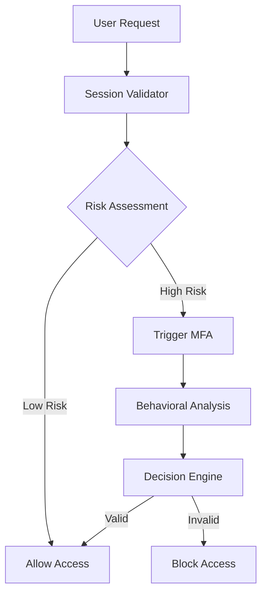
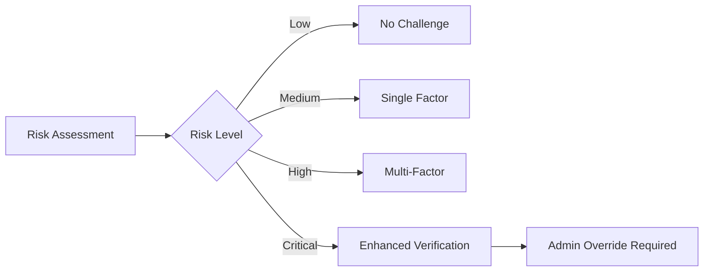

# Zero-Trust Identity Verification System Design
## Phase 14.1 - Shin AI Platform

## Overview

The Identity Verification System implements continuous authentication with behavioral biometrics and risk-based access control, providing adaptive security measures that evolve based on user behavior patterns and contextual risk factors.

## System Architecture

### Core Components

#### 1. Continuous Authentication Service (CAS)
**Purpose**: Real-time session validation and behavioral analysis

**Key Features**:
- Session hijacking detection
- Real-time behavioral pattern analysis
- Adaptive session timeout based on risk score
- Cross-device session correlation

**Architecture**:


#### 2. Behavioral Analytics Engine (BAE)
**Purpose**: Machine learning-based user behavior analysis

**Behavioral Metrics**:
- **Typing Patterns**: Keystroke dynamics, typing speed, error rates
- **Mouse/Touch Interactions**: Movement patterns, click frequency, gesture analysis
- **Navigation Patterns**: Page visit sequences, time spent per page, feature usage
- **Time-based Patterns**: Login times, session duration, activity peaks
- **Device Patterns**: Device fingerprinting, location consistency, network characteristics

**ML Models**:
- **Anomaly Detection**: Isolation Forest for behavioral anomalies
- **Pattern Recognition**: LSTM networks for temporal behavior patterns
- **Risk Scoring**: Gradient Boosting for multi-factor risk assessment
- **Adaptive Learning**: Online learning for user-specific behavior models

#### 3. Risk-based Access Control Engine (RACE)
**Purpose**: Dynamic access control based on contextual risk factors

**Risk Factors**:
- **User Context**: Authentication age, device familiarity, location consistency
- **Behavioral Anomalies**: Deviation from normal behavior patterns
- **Environmental Factors**: Time of day, network type, geographic location
- **Resource Sensitivity**: Classification of requested resources/data
- **Threat Intelligence**: Known threats, compromised credentials

**Risk Scoring Algorithm**:
```typescript
interface RiskScore {
  baseScore: number;        // 0-100
  behavioralScore: number;   // 0-100
  contextualScore: number;   // 0-100
  threatScore: number;      // 0-100
  finalScore: number;       // Weighted combination
}

const calculateRiskScore = (factors: RiskFactors): RiskScore => {
  const weights = {
    behavioral: 0.4,
    contextual: 0.3,
    threat: 0.3
  };

  return {
    baseScore: factors.baseScore,
    behavioralScore: analyzeBehavioralAnomalies(factors),
    contextualScore: analyzeContextualFactors(factors),
    threatScore: checkThreatIntelligence(factors),
    finalScore: Math.round(
      factors.baseScore * 0.2 +
      analyzeBehavioralAnomalies(factors) * weights.behavioral +
      analyzeContextualFactors(factors) * weights.contextual +
      checkThreatIntelligence(factors) * weights.threat
    )
  };
};
```

#### 4. Adaptive Multi-Factor Authentication (A-MFA)
**Purpose**: Context-aware authentication challenges

**Challenge Types**:
- **Knowledge-based**: Dynamic questions based on user history
- **Possession-based**: Push notifications, hardware tokens, authenticator apps
- **Biometric**: Fingerprint, facial recognition, voice patterns
- **Behavioral**: Implicit authentication through behavior patterns

**Adaptive Logic**:


### Database Schema Extensions

#### User Behavioral Profile
```typescript
interface IUserBehavioralProfile {
  userId: ObjectId;
  baselinePatterns: {
    typingPattern: {
      averageSpeed: number;
      errorRate: number;
      commonPauses: number[];
    };
    navigationPattern: {
      commonPaths: string[];
      averageSessionTime: number;
      preferredFeatures: string[];
    };
    interactionPattern: {
      mouseSpeed: number;
      clickFrequency: number;
      scrollBehavior: string;
    };
  };
  riskThresholds: {
    behavioralDeviation: number;
    contextualAnomaly: number;
    sessionRisk: number;
  };
  lastUpdated: Date;
  modelVersion: string;
}
```

#### Authentication Events
```typescript
interface IAuthenticationEvent {
  userId: ObjectId;
  sessionId: string;
  eventType: 'login' | 'mfa_challenge' | 'behavioral_check' | 'risk_assessment';
  riskScore: number;
  factors: {
    ipAddress: string;
    userAgent: string;
    location: GeoLocation;
    timestamp: Date;
    behavioralMetrics: BehavioralMetrics;
  };
  outcome: 'success' | 'failure' | 'challenge_required';
  metadata: Record<string, any>;
}
```

#### Risk Assessment Logs
```typescript
interface IRiskAssessmentLog {
  userId: ObjectId;
  sessionId: string;
  assessmentId: string;
  riskFactors: RiskFactor[];
  calculatedScore: number;
  decision: 'allow' | 'deny' | 'challenge' | 'escalate';
  confidence: number;
  modelVersion: string;
  timestamp: Date;
}
```

### API Specifications

#### Continuous Authentication API
```typescript
interface ContinuousAuthAPI {
  // Real-time session validation
  POST /api/security/auth/validate-session
  {
    sessionId: string;
    behavioralData: BehavioralMetrics;
    contextualData: ContextualFactors;
  }

  // Behavioral pattern update
  POST /api/security/auth/update-behavioral-profile
  {
    userId: string;
    newPatterns: BehavioralPatternUpdate;
  }

  // Risk assessment
  POST /api/security/auth/assess-risk
  {
    userId: string;
    context: RequestContext;
    behavioralMetrics: BehavioralMetrics;
  }
}
```

#### Adaptive MFA API
```typescript
interface AdaptiveMFAAPI {
  // Get appropriate challenge type
  GET /api/security/mfa/challenge-type/:userId
  Response: {
    challengeType: 'none' | 'single' | 'multi' | 'enhanced';
    factors: MFAFactor[];
    reason: string;
  }

  // Initiate challenge
  POST /api/security/mfa/initiate
  {
    userId: string;
    challengeType: string;
    targetFactors: string[];
  }

  // Verify challenge response
  POST /api/security/mfa/verify
  {
    challengeId: string;
    responses: MFAChallengeResponse[];
  }
}
```

### Integration Points

#### NextAuth.js Enhancement
- **Session Callbacks**: Enhanced JWT callbacks for continuous validation
- **Event Handlers**: Custom events for behavioral analysis triggers
- **Provider Integration**: Extended providers for adaptive MFA

#### Existing API Security Integration
- **Request Interceptors**: Behavioral data collection on API requests
- **Risk Assessment**: Integration with existing API key validation
- **Usage Tracking**: Enhanced usage events with security context

### Implementation Strategy

#### Phase 1: Foundation (Weeks 1-4)
- Database schema extensions for behavioral profiles
- Basic behavioral metrics collection
- Simple risk scoring algorithm
- Integration with existing authentication flow

#### Phase 2: Core Features (Weeks 5-8)
- ML model development for behavioral analysis
- Real-time risk assessment engine
- Adaptive MFA implementation
- Session hijacking detection

#### Phase 3: Advanced Capabilities (Weeks 9-12)
- Advanced anomaly detection models
- Cross-device behavior correlation
- Threat intelligence integration
- Performance optimization

### Security Considerations

#### Privacy Protection
- **Data Minimization**: Collect only necessary behavioral metrics
- **Consent Management**: User consent for behavioral analysis
- **Data Retention**: Limited retention of behavioral data
- **Anonymization**: Behavioral data anonymization techniques

#### Performance Impact
- **Caching Strategy**: Risk score caching for performance
- **Asynchronous Processing**: Background behavioral analysis
- **Load Balancing**: Distributed risk assessment processing
- **Database Optimization**: Indexed queries for real-time assessment

#### Compliance Requirements
- **GDPR Compliance**: Privacy-by-design implementation
- **Audit Logging**: Comprehensive security event logging
- **Data Protection**: Encryption of sensitive behavioral data
- **User Rights**: User access to their behavioral profiles

This Identity Verification System provides a comprehensive foundation for Zero-Trust security, enabling continuous authentication and adaptive access control based on user behavior patterns and contextual risk factors.