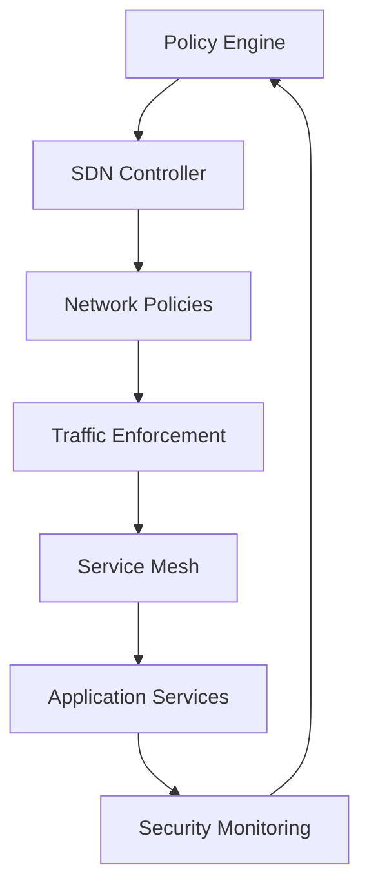
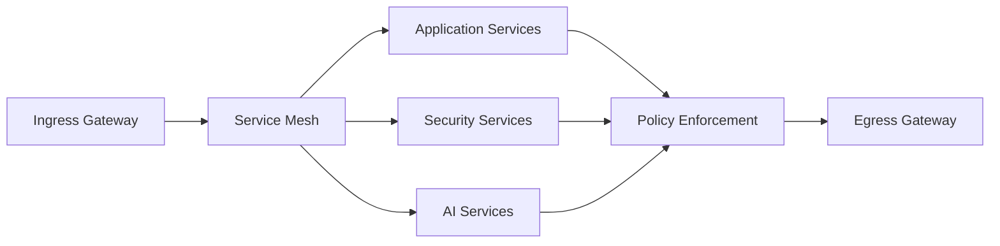

# Zero-Trust Micro-segmentation Architecture Design
## Phase 14.1 - Shin AI Platform

## Overview

The Micro-segmentation Architecture implements network isolation with software-defined networking and application segmentation with containerization, providing granular access control and security boundaries throughout the infrastructure.

## System Architecture

### Core Components

#### 1. Software-Defined Networking Controller (SDNC)
**Purpose**: Centralized network policy management and enforcement

**Key Features**:
- Dynamic policy enforcement
- Real-time traffic analysis
- Automated network segmentation
- Integration with service mesh

**Architecture**:


#### 2. Container Security Platform (CSP)
**Purpose**: Application segmentation and containerized workload protection

**Components**:
- **Container Runtime Security**: Real-time container behavior analysis
- **Image Vulnerability Scanning**: Automated vulnerability assessment
- **Network Policies**: Kubernetes-native network segmentation
- **Pod Security Standards**: Enforced security contexts

#### 3. Data Classification and Protection Engine (DCPE)
**Purpose**: Automated data tagging and protection policy enforcement

**Classification Levels**:
- **Public**: Non-sensitive data, minimal protection
- **Internal**: Organization-internal data, standard protection
- **Confidential**: Sensitive business data, enhanced protection
- **Restricted**: Highly sensitive data, maximum protection

**Protection Measures**:
- **Encryption at Rest**: Field-level encryption for sensitive data
- **Access Logging**: Comprehensive audit trails for data access
- **Data Loss Prevention**: Content inspection and blocking
- **Tokenization**: Sensitive data replacement with tokens

#### 4. Policy Decision and Enforcement Points (PDEPs)
**Purpose**: Distributed policy enforcement across the infrastructure

**Enforcement Types**:
- **Network-based**: Traffic filtering and access control
- **Application-based**: API-level authorization and filtering
- **Data-based**: Field-level access control and encryption
- **Identity-based**: User and service authentication

### Network Architecture

#### Service Mesh Integration


#### Network Segmentation Strategy
- **Development Environment**: Isolated from production
- **Production Services**: Segmented by sensitivity level
- **AI/ML Services**: Isolated compute environments
- **Data Services**: Database and storage isolation
- **Management Services**: Administrative function isolation

### Containerization Architecture

#### Kubernetes Security Implementation
```yaml
# Network Policy Example
apiVersion: networking.k8s.io/v1
kind: NetworkPolicy
metadata:
  name: ai-service-isolation
spec:
  podSelector:
    matchLabels:
      app: ai-service
  policyTypes:
  - Ingress
  - Egress
  ingress:
  - from:
    - podSelector:
        matchLabels:
          app: api-gateway
    - namespaceSelector:
        matchLabels:
          name: security-services
  egress:
  - to:
    - podSelector:
        matchLabels:
          app: database
  - to: [] # Block all other egress
```

#### Pod Security Standards
```yaml
# Security Context Example
apiVersion: v1
kind: Pod
metadata:
  name: ai-service-pod
spec:
  securityContext:
    runAsNonRoot: true
    runAsUser: 1000
    fsGroup: 2000
  containers:
  - name: ai-service
    securityContext:
      allowPrivilegeEscalation: false
      readOnlyRootFilesystem: true
      capabilities:
        drop:
        - ALL
    resources:
      limits:
        cpu: "2"
        memory: "4Gi"
      requests:
        cpu: "500m"
        memory: "1Gi"
```

### Database Schema Extensions

#### Network Policies
```typescript
interface INetworkPolicy {
  id: string;
  name: string;
  organizationId: ObjectId;
  policyType: 'ingress' | 'egress' | 'service_mesh';
  source: {
    services: string[];
    namespaces: string[];
    labels: Record<string, string>;
  };
  destination: {
    services: string[];
    namespaces: string[];
    labels: Record<string, string>;
  };
  rules: {
    protocols: string[];
    ports: number[];
    actions: 'allow' | 'deny' | 'log' | 'encrypt';
  };
  conditions: {
    timeWindows: TimeWindow[];
    riskThresholds: number[];
    userRoles: string[];
  };
  isActive: boolean;
  createdAt: Date;
  updatedAt: Date;
}
```

#### Data Classification Rules
```typescript
interface IDataClassificationRule {
  id: string;
  organizationId: ObjectId;
  name: string;
  dataPattern: {
    fieldNames: string[];
    contentPatterns: RegExp[];
    dataTypes: string[];
  };
  classificationLevel: 'public' | 'internal' | 'confidential' | 'restricted';
  protectionRequirements: {
    encryptionRequired: boolean;
    accessLogging: boolean;
    approvalRequired: boolean;
    retentionPeriod: number;
  };
  automatedActions: {
    encrypt: boolean;
    mask: boolean;
    tokenize: boolean;
    alert: boolean;
  };
  isActive: boolean;
  createdAt: Date;
  updatedAt: Date;
}
```

#### Container Security Policies
```typescript
interface IContainerSecurityPolicy {
  id: string;
  organizationId: ObjectId;
  name: string;
  target: {
    namespaces: string[];
    labels: Record<string, string>;
    serviceTypes: string[];
  };
  securityRequirements: {
    runAsNonRoot: boolean;
    readOnlyRootFilesystem: boolean;
    privileged: boolean;
    capabilities: {
      add: string[];
      drop: string[];
    };
    resourceLimits: {
      cpu: string;
      memory: string;
    };
  };
  vulnerabilityThreshold: 'critical' | 'high' | 'medium' | 'low';
  complianceStandards: string[];
  isActive: boolean;
  createdAt: Date;
  updatedAt: Date;
}
```

### API Specifications

#### Network Policy Management API
```typescript
interface NetworkPolicyAPI {
  // Create network policy
  POST /api/security/network-policies
  {
    name: string;
    policyType: string;
    source: PolicyTarget;
    destination: PolicyTarget;
    rules: PolicyRule[];
  }

  // Get effective policies for service
  GET /api/security/network-policies/effective/:serviceId
  Response: {
    policies: NetworkPolicy[];
    effectiveRules: EffectiveRule[];
  }

  // Update policy enforcement
  PUT /api/security/network-policies/:policyId/enforcement
  {
    action: 'enable' | 'disable' | 'update';
    rules: PolicyRule[];
  }
}
```

#### Data Classification API
```typescript
interface DataClassificationAPI {
  // Classify data automatically
  POST /api/security/data/classify
  {
    data: Record<string, any>;
    context: ClassificationContext;
  }

  // Get classification rules
  GET /api/security/data/classification-rules
  Response: {
    rules: DataClassificationRule[];
    statistics: ClassificationStats;
  }

  // Update classification rule
  PUT /api/security/data/classification-rules/:ruleId
  {
    dataPattern: DataPattern;
    classificationLevel: string;
    protectionRequirements: ProtectionRequirement;
  }
}
```

#### Container Security API
```typescript
interface ContainerSecurityAPI {
  // Scan container images
  POST /api/security/containers/scan
  {
    imageName: string;
    imageTag: string;
    scanType: 'vulnerability' | 'compliance' | 'secrets';
  }

  // Get security policies
  GET /api/security/containers/policies
  Response: {
    policies: ContainerSecurityPolicy[];
    compliance: ComplianceStatus;
  }

  // Enforce security policy
  POST /api/security/containers/enforce-policy
  {
    policyId: string;
    targetServices: string[];
    enforcementMode: 'enforce' | 'audit' | 'warn';
  }
}
```

### Integration Points

#### Kubernetes Integration
- **Custom Resource Definitions**: Network policies and security contexts
- **Admission Controllers**: Policy validation before resource creation
- **Security Contexts**: Pod-level security enforcement
- **Network Policies**: Namespace and pod-level traffic control

#### Service Mesh Integration
- **Istio Integration**: Traffic management and security policies
- **Linkerd Integration**: Lightweight service mesh for security
- **Envoy Proxy**: Sidecar proxy for traffic interception
- **API Gateway**: Ingress traffic control and authentication

#### Existing Infrastructure Integration
- **API Gateway**: Integration with existing API security layer
- **Authentication System**: User context for policy decisions
- **Database Layer**: Data classification and protection
- **Monitoring System**: Security event collection and alerting

### Implementation Strategy

#### Phase 1: Foundation (Weeks 1-6)
- Kubernetes network policies implementation
- Basic container security contexts
- Service mesh deployment (Istio/Linkerd)
- Integration with existing API gateway

#### Phase 2: Core Security (Weeks 7-14)
- Advanced network segmentation
- Data classification engine
- Container vulnerability scanning
- Policy-based access control

#### Phase 3: Advanced Features (Weeks 15-22)
- Zero-trust network architecture
- Advanced threat detection
- Automated policy management
- Multi-cluster security orchestration

#### Phase 4: Optimization (Weeks 23-26)
- Performance optimization
- Advanced automation
- Machine learning policy optimization
- Enterprise integration completion

### Security Considerations

#### Attack Surface Reduction
- **Minimal Attack Surface**: Principle of least privilege implementation
- **Network Segmentation**: Isolation of sensitive components
- **Container Hardening**: Secure container configurations
- **Access Minimization**: Just-in-time and just-enough access

#### Compliance and Governance
- **Policy as Code**: Infrastructure as code for security policies
- **Audit Trail**: Comprehensive logging of policy changes
- **Compliance Reporting**: Automated compliance evidence collection
- **Change Management**: Approval workflows for policy changes

#### Performance and Scalability
- **Policy Caching**: Distributed policy decision caching
- **Asynchronous Enforcement**: Background policy evaluation
- **Load Balancing**: Security service load distribution
- **Horizontal Scaling**: Stateless security service design

This Micro-segmentation Architecture provides comprehensive network isolation and application segmentation, implementing Zero-Trust principles through software-defined networking and containerization security controls.