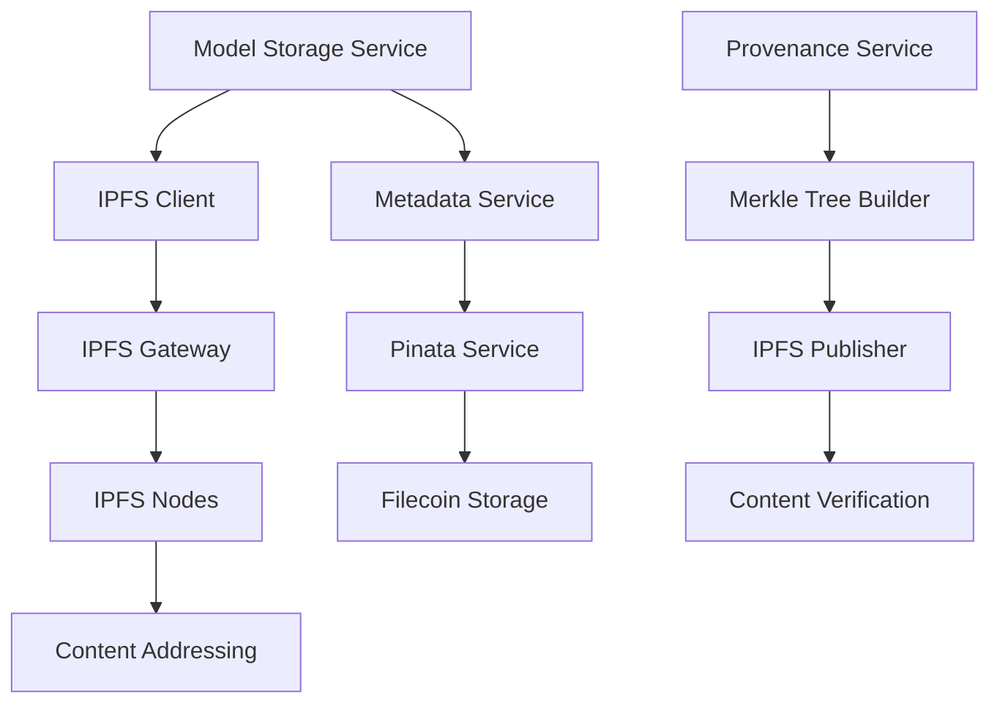
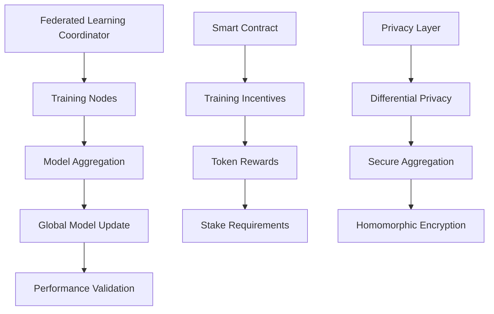
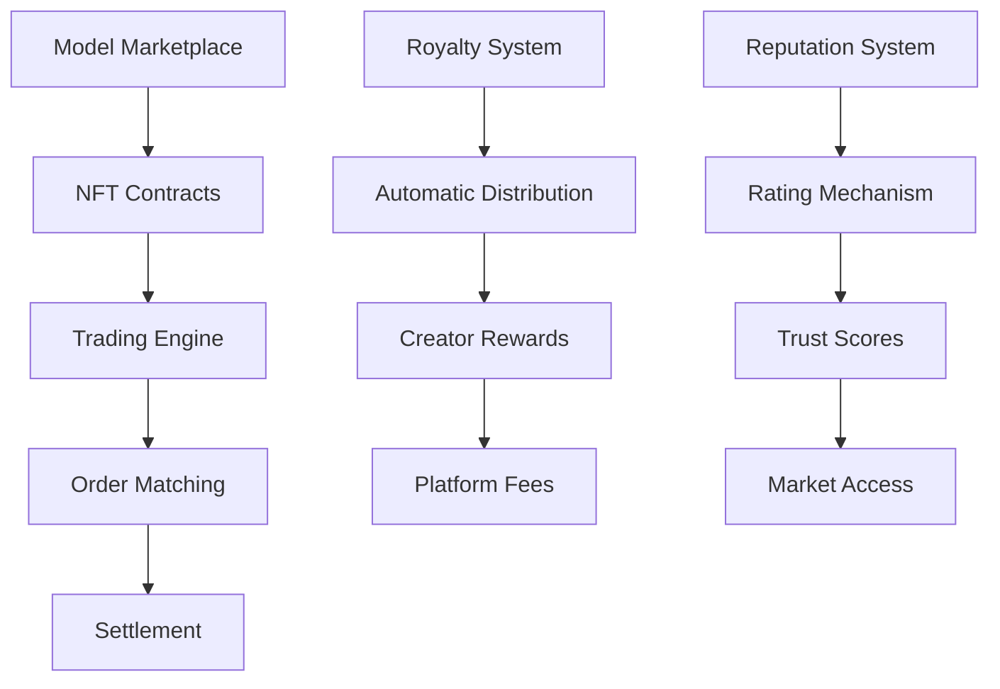
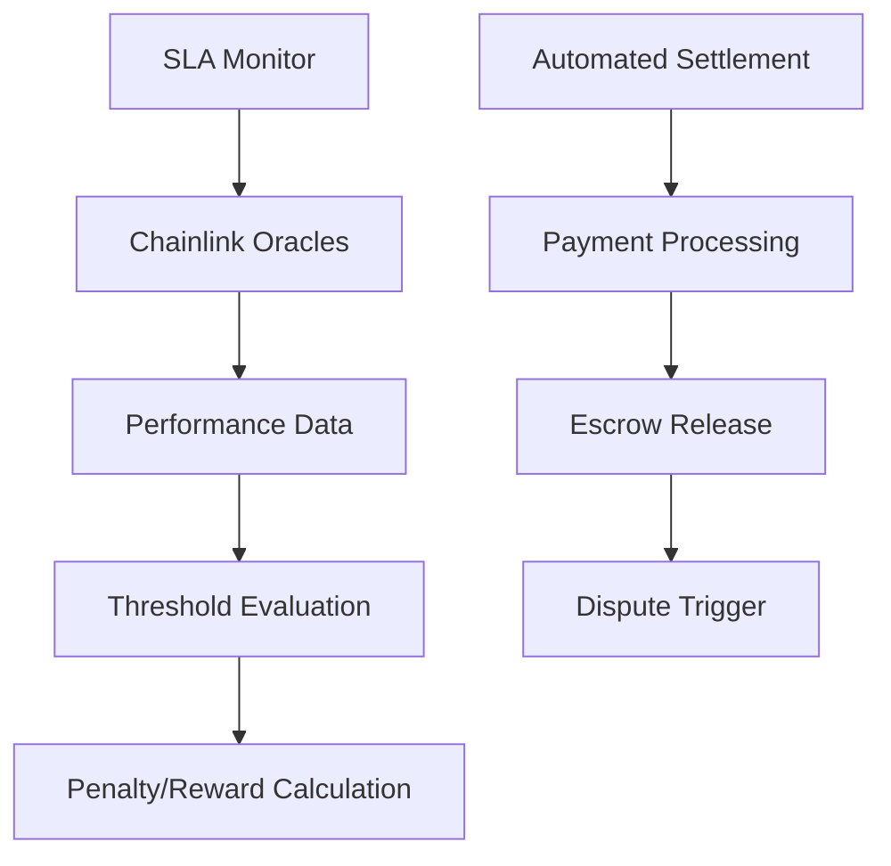
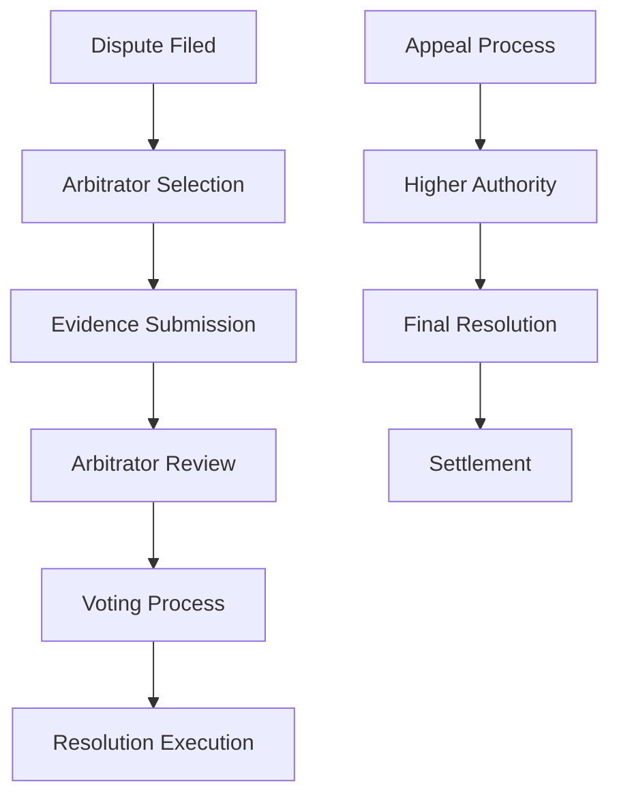

# Blockchain Integration Design (Phase 14.3)
## Shin AI Platform - Comprehensive Architectural Design

## Executive Summary

This document presents the complete architectural design for Phase 14.3 of the Shin AI Platform, implementing comprehensive blockchain integration with a focus on model provenance, decentralized AI infrastructure, and smart contract automation. The design supports multi-chain deployment (Ethereum, Polygon, Solana), integrates with major DeFi protocols, and ensures enterprise-grade security and performance.

## 1. System Architecture Overview

### 1.1 High-Level Architecture

```mermaid
graph TB
    A[Shin AI Platform] --> B[Blockchain Layer]
    A --> C[IPFS Layer]
    A --> D[Smart Contracts]
    A --> E[DeFi Integration]

    B --> F[Ethereum Mainnet]
    B --> G[Polygon PoS]
    B --> H[Solana Mainnet]
    B --> I[Ethereum Testnets]
    B --> J[Polygon Testnets]
    B --> K[Solana Devnet]

    D --> L[Model Registry]
    D --> M[Marketplace Contracts]
    D --> N[SLA Contracts]
    D --> O[Escrow Contracts]
    D --> P[Arbitration Contracts]

    E --> Q[Uniswap V3]
    E --> R[Aave Protocol]
    E --> S[Compound Finance]
    E --> T[Chainlink Oracles]

    C --> U[Model Storage]
    C --> V[Training Data]
    C --> W[Audit Logs]
    C --> X[Metadata]
```



### 1.2 Core Components

#### Blockchain Integration Layer
- **Multi-Chain Support**: Ethereum, Polygon, Solana with cross-chain bridges
- **Smart Contract Suite**: Comprehensive contracts for AI model lifecycle management
- **DeFi Integration**: Automated payment processing and liquidity management
- **Oracle Integration**: Real-time data feeds for SLA monitoring and pricing

#### Model Provenance System
- **Merkle Tree Implementation**: Cryptographic verification of training data integrity
- **IPFS Integration**: Decentralized storage for model artifacts and metadata
- **On-Chain Versioning**: Immutable model registry with provenance tracking
- **Audit Trail System**: Tamper-proof logging with consensus validation

#### Decentralized AI Infrastructure
- **Federated Learning Framework**: Distributed training coordination
- **Model Marketplace**: NFT-based trading platform for AI models
- **Token Incentive System**: Staking and reward mechanisms
- **Proof-of-Stake Consensus**: Validator network for model validation

## 2. Model Provenance System

### 2.1 Merkle Tree Implementation

#### Training Data Provenance
```typescript
interface TrainingDataProvenance {
  datasetId: string;
  dataHash: string;
  merkleRoot: string;
  merkleProofs: string[];
  dataSources: DataSource[];
  preprocessingSteps: PreprocessingStep[];
  timestamp: number;
  blockNumber: number;
  transactionHash: string;
}

interface DataSource {
  source: string;
  hash: string;
  size: number;
  format: string;
  license: string;
  verificationHash: string;
}
```

#### Model Versioning System
```solidity
contract ModelRegistry {
    struct ModelVersion {
        bytes32 modelId;
        bytes32 parentVersion;
        bytes32 trainingDataHash;
        bytes32 modelHash;
        bytes32 merkleRoot;
        string ipfsHash;
        uint256 timestamp;
        address creator;
        bytes32 signature;
    }

    mapping(bytes32 => ModelVersion[]) public modelVersions;
    mapping(bytes32 => bytes32) public latestVersion;

    event ModelRegistered(
        bytes32 indexed modelId,
        bytes32 indexed versionId,
        address indexed creator,
        bytes32 trainingDataHash
    );
}
```

### 2.2 IPFS Integration Architecture

#### Storage Layer Design


#### Data Flow Architecture
1. **Model Artifact Upload**: Models are chunked and uploaded to IPFS
2. **Metadata Generation**: Comprehensive metadata with provenance information
3. **Merkle Tree Construction**: Training data verification tree creation
4. **On-Chain Registration**: IPFS hashes and Merkle roots stored on-chain
5. **Verification Process**: On-demand integrity verification

### 2.3 Audit Trail System

#### Event Logging Architecture
```typescript
interface AuditEvent {
  eventId: string;
  eventType: 'model_training' | 'model_deployment' | 'data_access' | 'model_update';
  actor: address;
  resource: string;
  action: string;
  timestamp: number;
  blockNumber: number;
  transactionHash: string;
  metadata: Record<string, any>;
  signature: bytes;
}

interface ConsensusValidation {
  eventHash: string;
  validatorSignatures: address[];
  consensusTimestamp: number;
  validationProof: bytes;
}
```

## 3. Decentralized AI Infrastructure

### 3.1 Federated Learning Framework

#### Distributed Training Coordination


#### Training Node Architecture
```typescript
interface TrainingNode {
  nodeId: string;
  organizationId: string;
  stakeAmount: BigNumber;
  reputationScore: number;
  performanceMetrics: {
    accuracy: number;
    latency: number;
    uptime: number;
  };
  capabilities: {
    maxModelSize: number;
    supportedFrameworks: string[];
    computePower: number;
  };
}
```

### 3.2 NFT-Based Model Marketplace

#### Model Tokenization
```solidity
contract ModelNFT {
    struct ModelToken {
        uint256 tokenId;
        bytes32 modelId;
        bytes32 modelHash;
        string ipfsMetadata;
        address creator;
        uint256 price;
        uint256 royaltyPercentage;
        bool isActive;
    }

    mapping(uint256 => ModelToken) public modelTokens;
    mapping(bytes32 => uint256[]) public modelTokenIds;

    event ModelTokenized(
        uint256 indexed tokenId,
        bytes32 indexed modelId,
        address indexed creator,
        uint256 price
    );
}
```

#### Marketplace Architecture


### 3.3 Token Incentive System

#### Staking Mechanism
```solidity
contract StakingContract {
    struct Stake {
        address staker;
        uint256 amount;
        uint256 lockPeriod;
        uint256 rewardRate;
        uint256 stakedAt;
        bool isActive;
    }

    mapping(address => Stake) public stakes;
    mapping(address => uint256) public stakingRewards;

    event Staked(address indexed staker, uint256 amount, uint256 lockPeriod);
    event Unstaked(address indexed staker, uint256 amount, uint256 reward);
}
```

#### Reward Distribution
```typescript
interface RewardSystem {
  // Training participation rewards
  trainingRewards: {
    baseReward: BigNumber;
    accuracyBonus: BigNumber;
    speedBonus: BigNumber;
    consistencyBonus: BigNumber;
  };

  // Model validation rewards
  validationRewards: {
    correctValidation: BigNumber;
    consensusBonus: BigNumber;
    earlyDetectionBonus: BigNumber;
  };

  // Marketplace rewards
  marketplaceRewards: {
    successfulSale: BigNumber;
    positiveRating: BigNumber;
    platformContribution: BigNumber;
  };
}
```

## 4. Smart Contract Architecture

### 4.1 SLA Enforcement Contracts

#### Service Level Agreement Structure
```solidity
contract SLAContract {
    struct ServiceLevelAgreement {
        bytes32 slaId;
        address serviceProvider;
        address consumer;
        bytes32 modelId;
        uint256[] performanceMetrics;
        uint256[] thresholds;
        uint256 penaltyRate;
        uint256 rewardRate;
        uint256 duration;
        bool isActive;
    }

    mapping(bytes32 => ServiceLevelAgreement) public slas;
    mapping(bytes32 => PerformanceData) public performanceData;
}
```

#### Oracle Integration


### 4.2 Payment Automation with DeFi

#### Multi-Token Payment System
```solidity
contract PaymentContract {
    struct Payment {
        bytes32 paymentId;
        address payer;
        address payee;
        address tokenAddress;
        uint256 amount;
        bytes32 modelId;
        bytes32 slaId;
        uint256 dueDate;
        bool isCompleted;
    }

    mapping(bytes32 => Payment) public payments;
    mapping(address => uint256) public balances;
}
```

#### DeFi Protocol Integration
```typescript
interface DeFiIntegration {
  // Uniswap V3 for token swaps
  uniswap: {
    router: address;
    factory: address;
    supportedTokens: string[];
    liquidityPools: Record<string, address>;
  };

  // Aave for lending/borrowing
  aave: {
    pool: address;
    aTokens: Record<string, address>;
    debtTokens: Record<string, address>;
  };

  // Compound for yield farming
  compound: {
    comptroller: address;
    cTokens: Record<string, address>;
  };
}
```

### 4.3 Multi-Signature Escrow System

#### Escrow Contract Architecture
```solidity
contract MultiSigEscrow {
    struct Escrow {
        bytes32 escrowId;
        address buyer;
        address seller;
        address[] signers;
        uint256 requiredSignatures;
        address tokenAddress;
        uint256 amount;
        bytes32 modelId;
        uint256 releaseTime;
        bool isReleased;
    }

    mapping(bytes32 => Escrow) public escrows;
    mapping(bytes32 => mapping(address => bool)) public signatures;
}
```

#### Release Conditions
```typescript
interface ReleaseConditions {
  // Time-based release
  timeLock: {
    releaseTime: uint256;
    canEarlyRelease: boolean;
    earlyReleasePenalty: uint256;
  };

  // Performance-based release
  performance: {
    accuracyThreshold: number;
    latencyThreshold: number;
    uptimeThreshold: number;
  };

  // Oracle-verified conditions
  oracle: {
    dataFeeds: string[];
    verificationThreshold: number;
  };
}
```

### 4.4 Dispute Resolution System

#### Arbitration Contract
```solidity
contract ArbitrationContract {
    struct Dispute {
        bytes32 disputeId;
        bytes32 escrowId;
        address complainant;
        address respondent;
        string reason;
        uint256 amount;
        address[] arbitrators;
        uint256 requiredVotes;
        bytes32 proposedResolution;
        bool isResolved;
    }

    mapping(bytes32 => Dispute) public disputes;
    mapping(bytes32 => mapping(address => bytes32)) public arbitratorVotes;
}
```

#### Resolution Process


## 5. Database Schema Design

### 5.1 Blockchain Data Models

#### Model Provenance Schema
```typescript
interface ModelProvenanceDocument {
  _id: ObjectId;
  modelId: string;
  version: string;
  blockchain: {
    network: 'ethereum' | 'polygon' | 'solana';
    contractAddress: string;
    transactionHash: string;
    blockNumber: number;
    tokenId?: number;
  };
  ipfs: {
    modelHash: string;
    metadataHash: string;
    merkleRoot: string;
    proofs: string[];
  };
  trainingData: {
    datasetHash: string;
    dataSources: DataSource[];
    preprocessing: PreprocessingStep[];
    validationHash: string;
  };
  auditTrail: AuditEvent[];
  createdAt: Date;
  updatedAt: Date;
}
```

#### Smart Contract Interaction Schema
```typescript
interface SmartContractDocument {
  _id: ObjectId;
  contractType: 'model_registry' | 'marketplace' | 'sla' | 'escrow' | 'arbitration';
  network: string;
  address: string;
  abi: any[];
  deployment: {
    deployer: string;
    transactionHash: string;
    blockNumber: number;
    gasUsed: number;
  };
  interfaces: {
    methods: string[];
    events: string[];
    dependencies: string[];
  };
  metadata: Record<string, any>;
}
```

### 5.2 Cross-Chain Bridge Schema
```typescript
interface CrossChainBridgeDocument {
  _id: ObjectId;
  bridgeId: string;
  sourceNetwork: string;
  targetNetwork: string;
  bridgeType: 'wormhole' | 'layerzero' | 'axelar';
  supportedTokens: string[];
  bridgeAddress: string;
  feeStructure: {
    baseFee: BigNumber;
    percentageFee: number;
    minimumAmount: BigNumber;
  };
  limits: {
    maxAmount: BigNumber;
    minAmount: BigNumber;
    dailyLimit: BigNumber;
  };
}
```

## 6. API Specifications

### 6.1 Blockchain Service APIs

#### Model Provenance API
```typescript
interface ModelProvenanceAPI {
  // Register new model with provenance
  registerModel: {
    method: 'POST';
    path: '/api/blockchain/models/register';
    body: {
      modelId: string;
      modelHash: string;
      trainingDataHash: string;
      metadata: Record<string, any>;
      network?: 'ethereum' | 'polygon' | 'solana';
    };
    response: {
      modelId: string;
      transactionHash: string;
      ipfsHash: string;
      merkleRoot: string;
    };
  };

  // Verify model provenance
  verifyProvenance: {
    method: 'GET';
    path: '/api/blockchain/models/{modelId}/verify';
    params: { modelId: string; network?: string };
    response: {
      isValid: boolean;
      merkleProof: string[];
      auditTrail: AuditEvent[];
      verificationHash: string;
    };
  };
}
```

#### Marketplace API
```typescript
interface MarketplaceAPI {
  // List model for sale
  listModel: {
    method: 'POST';
    path: '/api/blockchain/marketplace/list';
    body: {
      modelId: string;
      price: BigNumber;
      tokenAddress: string;
      royaltyPercentage: number;
      network: string;
    };
    response: {
      tokenId: number;
      listingId: string;
      transactionHash: string;
    };
  };

  // Purchase model
  purchaseModel: {
    method: 'POST';
    path: '/api/blockchain/marketplace/purchase';
    body: {
      tokenId: number;
      buyerAddress: string;
      paymentToken: string;
      network: string;
    };
    response: {
      purchaseId: string;
      transactionHash: string;
      escrowId: string;
    };
  };
}
```

## 7. Component Architecture

### 7.1 Core Components

#### Blockchain Service Layer
```typescript
interface BlockchainService {
  // Multi-chain provider management
  providers: {
    ethereum: Web3Provider;
    polygon: Web3Provider;
    solana: SolanaProvider;
  };

  // Smart contract interactions
  contracts: {
    modelRegistry: ModelRegistryContract;
    marketplace: MarketplaceContract;
    slaManager: SLAContract;
    escrow: EscrowContract;
    arbitration: ArbitrationContract;
  };

  // Cross-chain operations
  bridges: {
    wormhole: WormholeBridge;
    layerZero: LayerZeroBridge;
    axelar: AxelarBridge;
  };
}
```

#### IPFS Service Layer
```typescript
interface IPFSService {
  // Content management
  upload: (content: Buffer | string, options?: UploadOptions) => Promise<string>;
  download: (hash: string) => Promise<Buffer>;
  pin: (hash: string) => Promise<void>;
  unpin: (hash: string) => Promise<void>;

  // Metadata management
  storeMetadata: (metadata: Record<string, any>) => Promise<string>;
  getMetadata: (hash: string) => Promise<Record<string, any>>;

  // Merkle tree operations
  buildMerkleTree: (data: Buffer[]) => MerkleTree;
  generateProof: (tree: MerkleTree, index: number) => string[];
  verifyProof: (root: string, proof: string[], data: Buffer) => boolean;
}
```

### 7.2 Integration Components

#### Authentication Integration
```typescript
interface AuthIntegration {
  // Wallet authentication
  walletAuth: {
    signIn: (address: string, signature: string) => Promise<User>;
    verifySignature: (message: string, signature: string, address: string) => boolean;
    generateChallenge: (address: string) => string;
  };

  // Organization wallet management
  orgWallets: {
    createWallet: (orgId: string) => Promise<Wallet>;
    assignWallet: (orgId: string, walletAddress: string) => Promise<void>;
    getWallets: (orgId: string) => Promise<Wallet[]>;
  };
}
```

#### Database Integration
```typescript
interface DatabaseIntegration {
  // Blockchain transaction storage
  storeTransaction: (tx: BlockchainTransaction) => Promise<void>;
  getTransactions: (filter: TransactionFilter) => Promise<BlockchainTransaction[]>;

  // Smart contract event processing
  processContractEvent: (event: ContractEvent) => Promise<void>;
  storeContractEvent: (event: ContractEvent) => Promise<void>;

  // Cross-chain data synchronization
  syncCrossChainData: (sourceNetwork: string, targetNetwork: string) => Promise<void>;
}
```

## 8. Scalability and Performance Design

### 8.1 Performance Optimization

#### Caching Strategy
```typescript
interface CachingStrategy {
  // Multi-level caching
  levels: {
    memory: {
      ttl: number;
      maxSize: number;
      strategy: 'LRU';
    };
    redis: {
      ttl: number;
      clusters: string[];
      replication: boolean;
    };
    blockchain: {
      indexedData: string[];
      queryOptimization: boolean;
    };
  };

  // Cache invalidation
  invalidation: {
    events: string[];
    webhooks: string[];
    timeBased: boolean;
  };
}
```

#### Database Optimization
```typescript
interface DatabaseOptimization {
  // Indexing strategy
  indexes: {
    blockchainTransactions: ['network', 'blockNumber', 'timestamp'];
    smartContractEvents: ['contractAddress', 'eventType', 'blockNumber'];
    modelProvenance: ['modelId', 'version', 'blockchain.network'];
    crossChainBridges: ['sourceNetwork', 'targetNetwork', 'bridgeType'];
  };

  // Query optimization
  aggregation: {
    pipelineOptimization: boolean;
    parallelProcessing: boolean;
    resultCaching: boolean;
  };
}
```

### 8.2 Error Handling and Recovery

#### Comprehensive Error Management
```typescript
interface ErrorHandling {
  // Error classification
  categories: {
    blockchain: ['network_error', 'transaction_failed', 'insufficient_funds'];
    smartContract: ['revert', 'out_of_gas', 'invalid_parameters'];
    ipfs: ['upload_failed', 'download_failed', 'pinning_error'];
    defi: ['insufficient_liquidity', 'price_impact_too_high', 'slippage'];
  };

  // Recovery mechanisms
  recovery: {
    retry: {
      maxAttempts: number;
      backoffStrategy: 'exponential';
      retryableErrors: string[];
    };
    fallback: {
      alternativeProviders: string[];
      circuitBreaker: boolean;
      gracefulDegradation: boolean;
    };
  };
}
```

## 9. Monitoring and Observability

### 9.1 Metrics and Monitoring

#### Key Performance Indicators
```typescript
interface KPIs {
  // Blockchain performance
  blockchain: {
    transactionLatency: number;
    gasPrice: BigNumber;
    networkCongestion: number;
    crossChainBridgeTime: number;
  };

  // Smart contract performance
  smartContract: {
    executionTime: number;
    gasUsage: BigNumber;
    failureRate: number;
    oracleResponseTime: number;
  };

  // IPFS performance
  ipfs: {
    uploadSpeed: number;
    downloadSpeed: number;
    pinningSuccessRate: number;
    contentAvailability: number;
  };

  // Business metrics
  business: {
    modelRegistrations: number;
    marketplaceVolume: BigNumber;
    activeStakes: BigNumber;
    disputeResolutionTime: number;
  };
}
```

### 9.2 Alerting and Notification

#### Alert Configuration
```typescript
interface AlertingSystem {
  // Critical alerts
  critical: {
    blockchainNetworkDown: {
      threshold: number;
      channels: ['email', 'slack', 'pagerduty'];
    };
    smartContractFailure: {
      threshold: number;
      channels: ['email', 'slack'];
    };
    securityIncident: {
      threshold: 0;
      channels: ['email', 'slack', 'security_team'];
    };
  };

  // Warning alerts
  warning: {
    highGasPrice: {
      threshold: BigNumber;
      channels: ['email', 'slack'];
    };
    lowLiquidity: {
      threshold: BigNumber;
      channels: ['email'];
    };
  };
}
```

## 10. Security and Compliance

### 10.1 Enterprise Security Integration

#### Security Controls
```typescript
interface SecurityControls {
  // Access control
  accessControl: {
    roleBasedAccess: boolean;
    multiSignature: boolean;
    timeLock: boolean;
    emergencyStop: boolean;
  };

  // Key management
  keyManagement: {
    hardwareSecurityModule: boolean;
    keyRotation: boolean;
    backupProcedures: boolean;
    disasterRecovery: boolean;
  };

  // Audit and compliance
  audit: {
    transactionLogging: boolean;
    complianceReporting: boolean;
    regulatoryRequirements: string[];
    auditTrail: boolean;
  };
}
```

### 10.2 Compliance Framework

#### Regulatory Compliance
```typescript
interface ComplianceFramework {
  // GDPR compliance
  gdpr: {
    dataMinimization: boolean;
    consentManagement: boolean;
    rightToErasure: boolean;
    dataPortability: boolean;
  };

  // Financial regulations
  financial: {
    amlCompliance: boolean;
    kycProcedures: boolean;
    transactionMonitoring: boolean;
    reportingRequirements: boolean;
  };

  // AI-specific regulations
  aiRegulations: {
    modelTransparency: boolean;
    biasDetection: boolean;
    fairnessMetrics: boolean;
    explainabilityRequirements: boolean;
  };
}
```

## 11. Implementation Roadmap

### 11.1 Phase 1: Foundation (Weeks 1-4)

#### Week 1-2: Infrastructure Setup
- [ ] Deploy multi-chain infrastructure
- [ ] Set up IPFS nodes and gateways
- [ ] Implement smart contract framework
- [ ] Create database schemas

#### Week 3-4: Core Services
- [ ] Implement model provenance system
- [ ] Deploy smart contracts to testnets
- [ ] Create blockchain service APIs
- [ ] Set up monitoring and alerting

### 11.2 Phase 2: Advanced Features (Weeks 5-12)

#### Week 5-8: Marketplace and DeFi
- [ ] Implement NFT marketplace
- [ ] Integrate DeFi protocols
- [ ] Deploy SLA enforcement contracts
- [ ] Create escrow and arbitration systems

#### Week 9-12: Decentralized AI
- [ ] Implement federated learning framework
- [ ] Deploy token incentive system
- [ ] Create model validation network
- [ ] Integrate with existing AI infrastructure

### 11.3 Phase 3: Optimization (Weeks 13-20)

#### Week 13-16: Performance
- [ ] Optimize blockchain operations
- [ ] Implement caching strategies
- [ ] Performance testing and tuning
- [ ] Security audits

#### Week 17-20: Enterprise Integration
- [ ] Multi-cloud deployment
- [ ] Advanced compliance features
- [ ] Enterprise security integration
- [ ] Production deployment

## 12. Conclusion

This comprehensive blockchain integration design provides a robust, scalable, and secure foundation for the Shin AI Platform's decentralized AI capabilities. The architecture supports multi-chain deployment, integrates with major DeFi protocols, and ensures enterprise-grade security and compliance. The modular design allows for incremental implementation while maintaining system integrity and performance.

The design addresses all requirements including model provenance with Merkle trees, decentralized AI infrastructure, smart contract automation, and seamless integration with existing systems. The implementation roadmap provides a clear path to production deployment with proper testing, optimization, and enterprise integration.