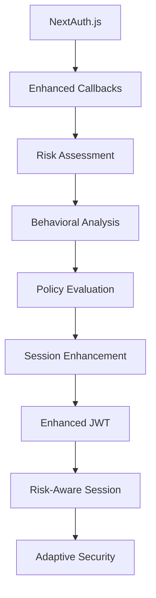
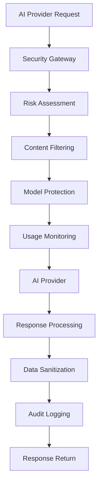
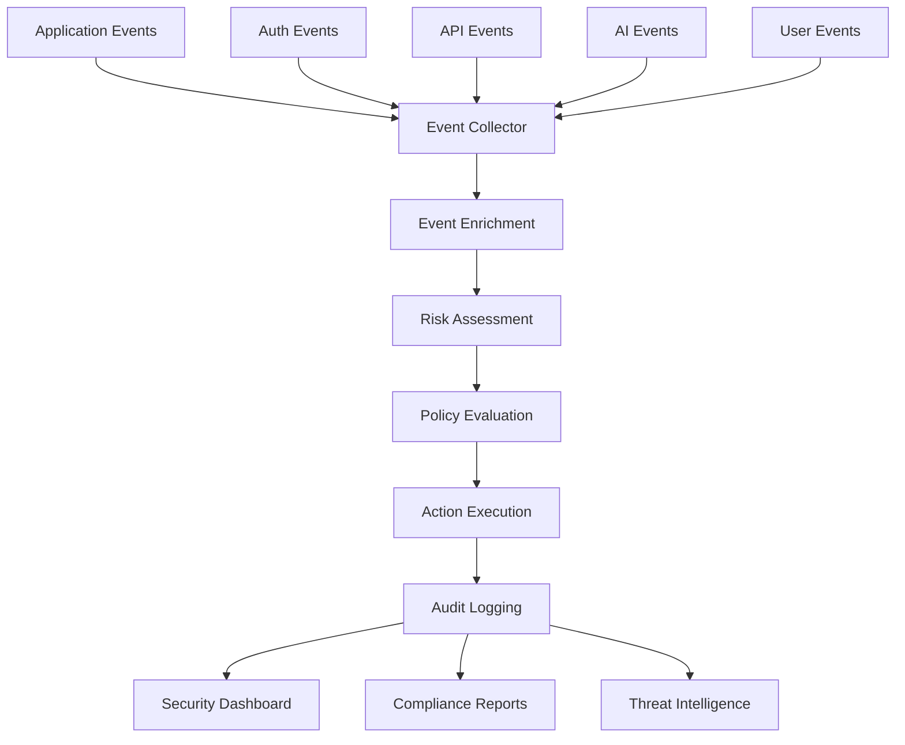

# Zero-Trust Security Integration Strategy
## Phase 14.1 - Shin AI Platform

## Overview

This integration strategy provides a comprehensive plan for integrating the Zero-Trust Security Architecture with the existing Shin AI Platform infrastructure, including AI provider systems, authentication mechanisms, and current security controls.

## Current Infrastructure Analysis

### Existing Authentication System
```typescript
interface CurrentAuthSystem {
  nextAuth: {
    version: '4.24.11';
    providers: ['credentials'];
    sessionStrategy: 'jwt';
    callbacks: ['jwt', 'session'];
  };
  apiSecurity: {
    apiKeyAuthentication: true;
    ipRestrictions: true;
    rateLimiting: true;
    scopes: ['chat:read', 'chat:write', 'providers:read', 'admin'];
  };
  userManagement: {
    multiTenant: true;
    organizationBased: true;
    roleBasedAccess: true;
  };
}
```

### AI Provider Infrastructure
```typescript
interface AIProviderInfrastructure {
  providers: {
    openai: {
      models: ['gpt-4', 'gpt-3.5-turbo', 'dall-e-3'];
      features: ['text-generation', 'image-generation'];
    };
    anthropic: {
      models: ['claude-3', 'claude-2'];
      features: ['text-generation', 'analysis'];
    };
    google: {
      models: ['gemini-pro', 'palm-2'];
      features: ['text-generation', 'multimodal'];
    };
    customProviders: ['replicate', 'together', 'huggingface'];
  };
  security: {
    apiKeyManagement: true;
    usageTracking: true;
    quotaManagement: true;
  };
}
```

### Database and Storage
```typescript
interface DataInfrastructure {
  primary: {
    type: 'mongodb';
    collections: ['users', 'organizations', 'apiKeys', 'usageEvents'];
  };
  caching: {
    type: 'redis';
    usage: ['sessions', 'policies', 'threat-intel'];
  };
  analytics: {
    type: 'clickhouse';
    usage: ['security-analytics', 'compliance-data'];
  };
}
```

## Integration Architecture

### 1. Authentication Integration

#### NextAuth.js Enhancement


#### Integration Points
```typescript
interface AuthIntegration {
  // Enhanced session callbacks
  callbacks: {
    jwt: async (token: JWT, user: User, account: Account) => {
      // Add security context to JWT
      token.riskScore = await riskAssessmentService.assessRisk(user.id);
      token.behavioralProfile = await behavioralService.getProfile(user.id);
      token.securityPolicies = await policyService.getEffectivePolicies(user.id);
      return token;
    };
    session: async (session: Session, token: JWT) => {
      // Enhance session with security data
      session.user.riskLevel = token.riskScore > 75 ? 'high' : 'normal';
      session.user.securityContext = {
        policies: token.securityPolicies,
        behavioralProfile: token.behavioralProfile
      };
      return session;
    };
  };

  // Custom authentication events
  events: {
    signIn: async (message: { user: User; account: Account }) => {
      await securityEventService.logEvent({
        type: 'authentication',
        action: 'sign_in',
        userId: message.user.id,
        riskScore: await riskAssessmentService.assessRisk(message.user.id)
      });
    };
    signOut: async (message: { token: JWT }) => {
      await sessionService.terminateSession(message.token.sessionId);
    };
  };
}
```

### 2. API Security Integration

#### Enhanced API Key Authentication
```typescript
interface APIKeyIntegration {
  // Enhanced authentication middleware
  middleware: {
    authenticate: async (request: NextRequest) => {
      const authResult = await authenticateApiKey(request);

      if (!authResult.isValid) {
        return { error: authResult.error };
      }

      // Add security context to request
      request.securityContext = {
        apiKey: authResult.apiKey,
        organization: authResult.organization,
        riskScore: await riskAssessmentService.assessApiKeyRisk(authResult.apiKey.id),
        policies: await policyService.getApiKeyPolicies(authResult.apiKey.id)
      };

      return { success: true, context: request.securityContext };
    };

    authorize: async (request: NextRequest, requiredScopes: string[]) => {
      const context = request.securityContext;

      // Check API key scopes
      const scopeCheck = validateScopes(context.apiKey.scopes, requiredScopes);
      if (!scopeCheck.valid) {
        return { error: 'Insufficient scopes', missingScopes: scopeCheck.missingScopes };
      }

      // Evaluate security policies
      const policyResult = await policyService.evaluatePolicies({
        subject: { type: 'api_key', id: context.apiKey.id },
        resource: getResourceFromRequest(request),
        action: getActionFromRequest(request),
        context: {
          organizationId: context.organization.id,
          riskScore: context.riskScore
        }
      });

      if (!policyResult.allowed) {
        return { error: 'Policy violation', reason: policyResult.reason };
      }

      return { success: true };
    };
  };
}
```

### 3. AI Provider Security Integration

#### Secure AI Provider Gateway


#### AI Security Middleware
```typescript
interface AISecurityMiddleware {
  // Request preprocessing
  preprocessRequest: async (request: AIRequest) => {
    // Risk assessment
    const riskScore = await riskAssessmentService.assessAIRequest(request);

    // Content filtering
    const filteredInput = await contentFilterService.filterInput(request.input);

    // Model selection based on security policies
    const allowedModels = await policyService.getAllowedModels(
      request.organizationId,
      request.sensitivity
    );

    return {
      filteredInput,
      riskScore,
      allowedModels,
      securityControls: await getSecurityControls(request)
    };
  };

  // Response postprocessing
  postprocessResponse: async (response: AIResponse, request: AIRequest) => {
    // Data sanitization
    const sanitizedResponse = await dataSanitizationService.sanitize(response.output);

    // Adversarial attack detection
    const attackDetection = await adversarialDetectionService.detect(response.output);

    // Usage tracking
    await usageTrackingService.trackAIUsage({
      organizationId: request.organizationId,
      model: request.model,
      inputTokens: response.inputTokens,
      outputTokens: response.outputTokens,
      riskScore: response.riskScore,
      securityEvents: response.securityEvents
    });

    return {
      sanitizedResponse,
      attackDetection,
      auditEvents: generateAuditEvents(response, request)
    };
  };
}
```

### 4. Database Integration

#### MongoDB Security Extensions
```typescript
interface DatabaseSecurityIntegration {
  // Enhanced user model
  userSchema: {
    securityProfile: {
      riskScore: { type: Number, default: 0 },
      behavioralProfile: { type: Object },
      securityPolicies: [{ type: ObjectId, ref: 'SecurityPolicy' }],
      lastRiskAssessment: { type: Date },
      securityEvents: [{
        type: { type: String, enum: ['login', 'mfa', 'risk_assessment'] },
        timestamp: { type: Date, default: Date.now },
        riskScore: Number,
        outcome: { type: String, enum: ['success', 'failure', 'challenge'] }
      }]
    };
  };

  // Enhanced API key model
  apiKeySchema: {
    securityContext: {
      riskThreshold: { type: Number, default: 50 },
      securityPolicies: [{ type: ObjectId, ref: 'SecurityPolicy' }],
      threatDetectionEnabled: { type: Boolean, default: true },
      behavioralMonitoring: { type: Boolean, default: true }
    };
  };

  // Security collections
  securityCollections: {
    securityPolicies: 'SecurityPolicy',
    threatIntelligence: 'ThreatIntelligence',
    securityEvents: 'SecurityEvent',
    riskAssessments: 'RiskAssessment',
    behavioralProfiles: 'BehavioralProfile'
  };
}
```

### 5. Event Integration

#### Security Event Pipeline


#### Event Processing
```typescript
interface EventProcessingIntegration {
  // Event collection from existing systems
  eventCollectors: {
    nextAuthEvents: {
      source: 'next-auth',
      events: ['signIn', 'signOut', 'session', 'token'],
      handler: async (event: NextAuthEvent) => {
        await securityEventService.processAuthEvent({
          type: 'authentication',
          userId: event.user.id,
          action: event.action,
          timestamp: event.timestamp,
          metadata: event.metadata
        });
      }
    };

    apiEvents: {
      source: 'api-routes',
      events: ['request', 'response', 'error'],
      handler: async (event: APIEvent) => {
        await securityEventService.processAPIEvent({
          type: 'api_access',
          apiKeyId: event.apiKey?.id,
          organizationId: event.organizationId,
          action: event.method + ' ' + event.path,
          riskScore: await riskAssessmentService.assessAPIEvent(event)
        });
      }
    };

    aiProviderEvents: {
      source: 'ai-providers',
      events: ['request', 'response', 'error', 'usage'],
      handler: async (event: AIEvent) => {
        await securityEventService.processAIEvent({
          type: 'ai_access',
          organizationId: event.organizationId,
          model: event.model,
          riskScore: event.riskScore,
          securityControls: event.securityControls
        });
      }
    };
  };
}
```

## Implementation Phases

### Phase 1: Foundation Integration (Weeks 1-4)

#### Week 1-2: Authentication Enhancement
**Tasks**:
- [ ] Extend NextAuth.js with security callbacks
- [ ] Add risk assessment to authentication flow
- [ ] Implement basic behavioral data collection
- [ ] Enhance session management with security context

**Integration Points**:
- NextAuth.js session callbacks
- Existing user authentication routes
- MongoDB user collection extensions

#### Week 3-4: API Security Integration
**Tasks**:
- [ ] Enhance existing API key authentication
- [ ] Add policy evaluation to API routes
- [ ] Implement security event logging
- [ ] Add risk-based rate limiting

**Integration Points**:
- Existing `api-security.ts` module
- API route middleware
- Usage tracking system

### Phase 2: Core Security Integration (Weeks 5-12)

#### Week 5-8: AI Provider Security
**Tasks**:
- [ ] Implement AI security gateway
- [ ] Add content filtering for AI requests
- [ ] Implement model protection mechanisms
- [ ] Add adversarial attack detection

**Integration Points**:
- Existing AI provider infrastructure
- Provider factory and base provider classes
- Usage tracking and quota management

#### Week 9-12: Advanced Features
**Tasks**:
- [ ] Deploy threat intelligence integration
- [ ] Implement micro-segmentation for AI services
- [ ] Add compliance monitoring
- [ ] Set up security dashboards

**Integration Points**:
- Existing organization and project management
- Database and storage systems
- Monitoring and analytics infrastructure

### Phase 3: Optimization and Monitoring (Weeks 13-20)

#### Week 13-16: Performance Optimization
**Tasks**:
- [ ] Implement security caching layers
- [ ] Optimize database queries for security data
- [ ] Add security metrics and monitoring
- [ ] Performance testing and tuning

**Integration Points**:
- Existing caching infrastructure (Redis)
- Database optimization and indexing
- Monitoring and alerting systems

#### Week 17-20: Enterprise Integration
**Tasks**:
- [ ] Multi-cloud security deployment
- [ ] Enterprise SSO integration
- [ ] Advanced compliance features
- [ ] Custom security policy management

**Integration Points**:
- Existing cloud infrastructure
- Organization management system
- Compliance and audit requirements

## Migration Strategy

### 1. Gradual Migration Approach
```typescript
interface MigrationStrategy {
  phases: [
    {
      name: 'authentication_enhancement',
      duration: '4 weeks',
      risk: 'low',
      rollback: 'immediate',
      testing: 'comprehensive'
    },
    {
      name: 'api_security_enhancement',
      duration: '4 weeks',
      risk: 'medium',
      rollback: '1 hour',
      testing: 'integration_focused'
    },
    {
      name: 'ai_provider_security',
      duration: '8 weeks',
      risk: 'medium',
      rollback: '4 hours',
      testing: 'security_focused'
    }
  ];

  rollbackPlan: {
    triggers: [
      'security_incident',
      'performance_degradation',
      'user_experience_impact'
    ],
    procedures: {
      immediate: 'disable_new_features',
      gradual: 'phase_by_phase_reversion',
      communication: 'stakeholder_notification'
    };
  };
}
```

### 2. Data Migration
```typescript
interface DataMigration {
  userSecurityProfiles: {
    source: 'existing_user_collection',
    target: 'enhanced_user_collection',
    mapping: {
      userId: 'userId',
      organizationId: 'organizationId',
      securityProfile: 'new_security_fields'
    },
    strategy: 'incremental',
    batchSize: 1000
  };

  apiKeySecurity: {
    source: 'existing_api_key_collection',
    target: 'enhanced_api_key_collection',
    mapping: {
      keyId: 'keyId',
      organizationId: 'organizationId',
      securityContext: 'new_security_fields'
    },
    strategy: 'real_time',
    validation: 'comprehensive'
  };
}
```

## Testing Strategy

### Integration Testing
```typescript
interface IntegrationTesting {
  authentication: {
    tests: [
      'nextauth_security_callbacks',
      'risk_assessment_integration',
      'behavioral_analysis_flow',
      'session_security_enhancement'
    ],
    coverage: 95,
    automation: 'full'
  };

  apiSecurity: {
    tests: [
      'enhanced_api_key_auth',
      'policy_evaluation_middleware',
      'security_event_logging',
      'rate_limiting_integration'
    ],
    coverage: 90,
    automation: 'full'
  };

  aiProviderSecurity: {
    tests: [
      'ai_security_gateway',
      'content_filtering',
      'model_protection',
      'adversarial_detection'
    ],
    coverage: 85,
    automation: 'semi_automated'
  };
}
```

### Performance Testing
```typescript
interface PerformanceTesting {
  benchmarks: {
    authenticationLatency: '< 200ms',
    apiSecurityOverhead: '< 50ms',
    aiSecurityProcessing: '< 100ms',
    databaseQueryTime: '< 100ms'
  };

  loadTesting: {
    concurrentUsers: 10000,
    apiRequestsPerSecond: 1000,
    aiRequestsPerSecond: 100,
    duration: '24 hours'
  };

  stressTesting: {
    peakLoad: '200% of normal',
    duration: '1 hour',
    recoveryTime: '< 5 minutes'
  };
}
```

## Risk Management

### Integration Risks
```typescript
interface IntegrationRisks {
  authentication: {
    risk: 'medium',
    impact: 'user_experience',
    mitigation: 'gradual_rollout',
    monitoring: 'continuous'
  };

  apiSecurity: {
    risk: 'medium',
    impact: 'api_performance',
    mitigation: 'caching_optimization',
    monitoring: 'real_time_metrics'
  };

  aiProviderSecurity: {
    risk: 'high',
    impact: 'ai_functionality',
    mitigation: 'feature_flags',
    monitoring: 'comprehensive_testing'
  };

  dataMigration: {
    risk: 'low',
    impact: 'data_integrity',
    mitigation: 'incremental_migration',
    monitoring: 'data_validation'
  };
}
```

### Mitigation Strategies
1. **Feature Flags**: Enable/disable security features per environment
2. **Gradual Rollout**: Percentage-based feature rollout
3. **Comprehensive Monitoring**: Real-time metrics and alerting
4. **Rollback Procedures**: Automated rollback capabilities
5. **Testing**: Extensive integration and performance testing

This integration strategy provides a comprehensive approach to integrating the Zero-Trust Security Architecture with the existing Shin AI Platform infrastructure, ensuring minimal disruption and maximum security benefits.