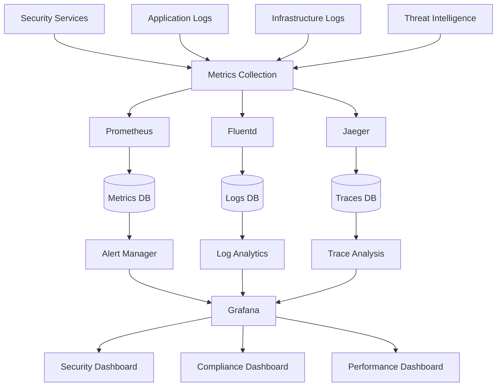
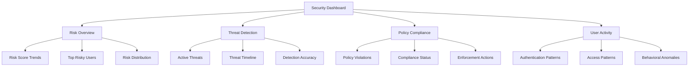
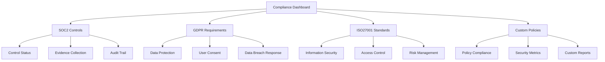
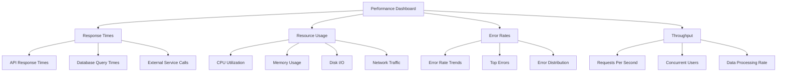

# Zero-Trust Security Monitoring and Observability Framework
## Phase 14.1 - Shin AI Platform

## Overview

This framework provides comprehensive monitoring and observability for the Zero-Trust Security Architecture, enabling real-time visibility into security events, system performance, and compliance status across the entire platform.

## Architecture Overview

### Monitoring Layers


## Metrics and Monitoring

### 1. Security Metrics

#### Identity & Access Metrics
```typescript
interface SecurityMetrics {
  // Authentication metrics
  authentication: {
    totalAttempts: Counter;
    successfulLogins: Counter;
    failedLogins: Counter;
    mfaChallenges: Counter;
    sessionHijackAttempts: Counter;
    riskScoreDistribution: Histogram; // 0-100
    averageRiskScore: Gauge;
  };

  // Authorization metrics
  authorization: {
    policyEvaluations: Counter;
    accessDenied: Counter;
    accessGranted: Counter;
    privilegeEscalationAttempts: Counter;
    zeroTrustViolations: Counter;
  };

  // Behavioral analysis metrics
  behavioral: {
    anomalyDetections: Counter;
    falsePositives: Counter;
    modelAccuracy: Gauge; // 0-1
    behavioralProfileUpdates: Counter;
    riskThresholdBreaches: Counter;
  };
}
```

#### Threat Intelligence Metrics
```typescript
interface ThreatIntelMetrics {
  // Feed processing metrics
  feeds: {
    totalFeeds: Gauge;
    activeFeeds: Gauge;
    feedUpdateFrequency: Histogram;
    feedProcessingLatency: Histogram;
    feedErrors: Counter;
  };

  // IOC detection metrics
  ioc: {
    indicatorsProcessed: Counter;
    threatsDetected: Counter;
    falsePositives: Counter;
    detectionAccuracy: Gauge;
    scanDuration: Histogram;
  };

  // Threat hunting metrics
  hunting: {
    queriesExecuted: Counter;
    findingsGenerated: Counter;
    automatedHunts: Counter;
    manualHunts: Counter;
    averageQueryTime: Histogram;
  };
}
```

#### Network Security Metrics
```typescript
interface NetworkSecurityMetrics {
  // Traffic analysis metrics
  traffic: {
    totalRequests: Counter;
    blockedRequests: Counter;
    encryptedRequests: Counter;
    anomalousTraffic: Counter;
    networkLatency: Histogram;
  };

  // Policy enforcement metrics
  policies: {
    policiesActive: Gauge;
    policyViolations: Counter;
    enforcementActions: Counter;
    policyEvaluationTime: Histogram;
  };

  // Service mesh metrics
  mesh: {
    serviceToServiceCalls: Counter;
    mTLSEnabled: Gauge;
    circuitBreakerTrips: Counter;
    retryAttempts: Counter;
  };
}
```

### 2. Performance Metrics

#### System Performance Metrics
```typescript
interface PerformanceMetrics {
  // Response time metrics
  responseTime: {
    p50: Histogram; // 50th percentile
    p95: Histogram; // 95th percentile
    p99: Histogram; // 99th percentile
    averageResponseTime: Gauge;
  };

  // Resource utilization metrics
  resources: {
    cpuUtilization: Gauge;
    memoryUtilization: Gauge;
    diskUtilization: Gauge;
    networkUtilization: Gauge;
  };

  // Error rate metrics
  errors: {
    errorRate: Gauge; // errors per second
    errorRate5xx: Counter;
    errorRate4xx: Counter;
    timeoutErrors: Counter;
  };
}
```

## Observability Components

### 1. Metrics Collection

#### Prometheus Configuration
```yaml
# Prometheus scrape configuration for security services
scrape_configs:
  - job_name: 'security-services'
    static_configs:
      - targets: ['identity-service:9090', 'policy-engine:9090', 'threat-intel:9090']
    scrape_interval: 15s
    metrics_path: /metrics

  - job_name: 'infrastructure'
    static_configs:
      - targets: ['kubernetes-nodes:9100', 'istio-mixer:9090']
    scrape_interval: 30s

# Custom security metrics
custom_metrics:
  - name: security_risk_score
    type: histogram
    buckets: [0, 10, 25, 50, 75, 90, 100]
    description: "Distribution of security risk scores"

  - name: policy_evaluation_duration
    type: histogram
    buckets: [0.001, 0.005, 0.01, 0.05, 0.1, 0.5, 1.0]
    description: "Time taken to evaluate security policies"
```

#### Metrics Endpoints
```typescript
// Security service metrics endpoint
GET /metrics
Response:
# TYPE security_authentication_attempts_total counter
security_authentication_attempts_total{status="success"} 15432
security_authentication_attempts_total{status="failed"} 234

# TYPE security_risk_score histogram
security_risk_score_bucket{le="10"} 12000
security_risk_score_bucket{le="25"} 8000
security_risk_score_bucket{le="50"} 4000
security_risk_score_bucket{le="75"} 2000
security_risk_score_bucket{le="100"} 1000
security_risk_score_bucket{le="+Inf"} 1000
```

### 2. Distributed Tracing

#### Jaeger Configuration
```yaml
# Jaeger service configuration
services:
  - name: identity-service
    endpoints: ['jaeger-collector:14268']
    sampling_rate: 0.1

  - name: policy-engine
    endpoints: ['jaeger-collector:14268']
    sampling_rate: 0.05

  - name: threat-intelligence
    endpoints: ['jaeger-collector:14268']
    sampling_rate: 0.02
```

#### Trace Context
```typescript
interface TraceContext {
  traceId: string;
  spanId: string;
  parentSpanId?: string;
  operationName: string;
  startTime: number;
  endTime: number;
  tags: {
    userId?: string;
    organizationId?: string;
    riskScore?: number;
    policyId?: string;
    threatLevel?: string;
    httpStatusCode?: number;
    error?: boolean;
  };
  logs: {
    timestamp: number;
    fields: Record<string, any>;
  }[];
}
```

### 3. Log Aggregation

#### Fluentd Configuration
```xml
# Fluentd configuration for security logs
<source>
  @type tail
  path /var/log/security/*.log
  pos_file /var/log/fluentd/security.log.pos
  tag security.*
  <parse>
    @type json
  </parse>
</source>

<filter security.**>
  @type record_transformer
  <record>
    organization_id ${record['organizationId'] || 'unknown'}
    user_id ${record['userId'] || 'system'}
    risk_level ${record['riskScore'] ? (record['riskScore'] > 75 ? 'high' : record['riskScore'] > 50 ? 'medium' : 'low') : 'unknown'}
  </record>
</filter>

<match security.**>
  @type elasticsearch
  host elasticsearch
  port 9200
  index_name security-#{Time.at(time).strftime('%Y.%m.%d')}
  include_timestamp true
</match>
```

## Dashboards and Visualization

### 1. Security Dashboard

#### Real-time Security Overview


#### Key Security KPIs
```typescript
interface SecurityKPIs {
  // Risk metrics
  averageRiskScore: {
    current: number;
    trend: 'up' | 'down' | 'stable';
    threshold: number;
  };

  // Threat metrics
  threatsDetected: {
    last24h: number;
    last7d: number;
    trend: 'increasing' | 'decreasing' | 'stable';
  };

  // Policy metrics
  policyViolations: {
    last24h: number;
    violationRate: number; // percentage
    topViolatedPolicies: PolicyViolation[];
  };

  // User metrics
  riskyUsers: {
    count: number;
    percentage: number;
    trend: 'increasing' | 'decreasing' | 'stable';
  };
}
```

### 2. Compliance Dashboard

#### Compliance Monitoring


#### Compliance Metrics
```typescript
interface ComplianceMetrics {
  // Overall compliance
  overallCompliance: {
    score: number; // 0-100
    status: 'compliant' | 'at_risk' | 'non_compliant';
    lastAssessed: Date;
  };

  // Control metrics
  controls: {
    totalControls: number;
    compliantControls: number;
    atRiskControls: number;
    nonCompliantControls: number;
    controlEffectiveness: number; // 0-100
  };

  // Evidence metrics
  evidence: {
    requiredEvidence: number;
    collectedEvidence: number;
    missingEvidence: number;
    evidenceFreshness: number; // days
  };

  // Audit metrics
  audits: {
    scheduledAudits: number;
    completedAudits: number;
    failedAudits: number;
    nextAuditDue: Date;
  };
}
```

### 3. Performance Dashboard

#### System Performance Monitoring


## Alerting and Notification

### 1. Alert Rules

#### Security Alert Rules
```yaml
# High-risk authentication attempts
groups:
  - name: security_alerts
    rules:
      - alert: HighRiskAuthentication
        expr: rate(security_authentication_attempts_total{status="failed"}[5m]) > 10
        for: 2m
        labels:
          severity: critical
          category: security
        annotations:
          summary: "High number of failed authentication attempts"
          description: "More than 10 failed login attempts per 5 minutes detected"

      - alert: RiskScoreSpike
        expr: security_risk_score > 75
        for: 1m
        labels:
          severity: warning
          category: security
        annotations:
          summary: "Elevated risk score detected"
          description: "User action with risk score above 75 detected"

      - alert: ThreatDetectionIncrease
        expr: rate(threats_detected_total[15m]) > rate(threats_detected_total[1h]) * 2
        for: 5m
        labels:
          severity: warning
          category: security
        annotations:
          summary: "Increased threat detection rate"
          description: "Threat detection rate has doubled in the last hour"
```

#### Performance Alert Rules
```yaml
# Performance degradation alerts
      - alert: HighResponseTime
        expr: histogram_quantile(0.95, rate(http_request_duration_seconds_bucket[5m])) > 1.0
        for: 3m
        labels:
          severity: warning
          category: performance
        annotations:
          summary: "High API response time"
          description: "95th percentile response time above 1 second"

      - alert: HighErrorRate
        expr: rate(http_requests_total{status=~"5.."}[5m]) / rate(http_requests_total[5m]) > 0.05
        for: 2m
        labels:
          severity: critical
          category: performance
        annotations:
          summary: "High error rate detected"
          description: "Error rate above 5% for more than 2 minutes"
```

### 2. Notification Channels

#### Alert Notification Configuration
```typescript
interface NotificationConfig {
  channels: {
    email: {
      enabled: true;
      recipients: string[];
      severityThreshold: 'medium';
    };
    slack: {
      enabled: true;
      webhookUrl: string;
      channels: string[];
      severityThreshold: 'low';
    };
    pagerduty: {
      enabled: true;
      integrationKey: string;
      severityThreshold: 'high';
    };
    webhook: {
      enabled: true;
      endpoints: string[];
      severityThreshold: 'info';
    };
  };

  escalation: {
    enabled: true;
    rules: [
      {
        condition: 'no_acknowledgment_after_5_minutes',
        action: 'escalate_to_next_level'
      },
      {
        condition: 'severity_critical',
        action: 'immediate_escalation'
      }
    ];
  };
}
```

## Analytics and Reporting

### 1. Security Analytics

#### Threat Analysis Queries
```sql
-- Top threat types in the last 24 hours
SELECT
  threat_type,
  COUNT(*) as count,
  AVG(confidence) as avg_confidence,
  MAX(severity) as max_severity
FROM threat_intelligence
WHERE timestamp >= NOW() - INTERVAL '24 hours'
GROUP BY threat_type
ORDER BY count DESC;

-- Risk score trends over time
SELECT
  DATE_TRUNC('hour', timestamp) as hour,
  AVG(risk_score) as avg_risk,
  MAX(risk_score) as max_risk,
  COUNT(*) as event_count
FROM risk_assessments
WHERE timestamp >= NOW() - INTERVAL '7 days'
GROUP BY hour
ORDER BY hour;
```

#### Behavioral Analysis
```sql
-- User behavior anomaly detection
SELECT
  user_id,
  organization_id,
  AVG(behavioral_deviation) as avg_deviation,
  MAX(behavioral_deviation) as max_deviation,
  COUNT(*) as anomaly_count
FROM user_behavioral_profiles
WHERE last_updated >= NOW() - INTERVAL '24 hours'
  AND behavioral_deviation > 50
GROUP BY user_id, organization_id
ORDER BY avg_deviation DESC;
```

### 2. Compliance Reporting

#### Automated Compliance Reports
```typescript
interface ComplianceReport {
  reportId: string;
  reportType: 'soc2' | 'gdpr' | 'iso27001' | 'custom';
  organizationId: string;
  dateRange: {
    from: Date;
    to: Date;
  };
  sections: {
    controlObjectives: ControlObjective[];
    evidence: Evidence[];
    findings: Finding[];
    recommendations: Recommendation[];
  };
  overallStatus: 'compliant' | 'at_risk' | 'non_compliant';
  generatedAt: Date;
  generatedBy: string;
}
```

## Integration Points

### 1. External Monitoring Systems
```typescript
interface ExternalIntegrations {
  siem: {
    splunk: {
      enabled: true;
      endpoint: string;
      token: string;
      index: string;
    };
    elk: {
      enabled: true;
      endpoint: string;
      username: string;
      password: string;
    };
  };

  cloudMonitoring: {
    aws: {
      cloudwatch: {
        enabled: true;
        region: string;
        accessKeyId: string;
        secretAccessKey: string;
      };
      guardduty: {
        enabled: true;
        region: string;
        findingsTopic: string;
      };
    };
  };
}
```

### 2. Incident Response Integration
```typescript
interface IncidentResponseIntegration {
  ticketing: {
    jira: {
      enabled: true;
      baseUrl: string;
      username: string;
      apiToken: string;
      projectKey: string;
    };
    servicenow: {
      enabled: true;
      instance: string;
      username: string;
      password: string;
    };
  };

  communication: {
    slack: {
      enabled: true;
      webhookUrl: string;
      channels: string[];
    };
    teams: {
      enabled: true;
      webhookUrl: string;
    };
  };
}
```

This comprehensive monitoring and observability framework provides complete visibility into the Zero-Trust Security Architecture, enabling proactive security management and compliance assurance.