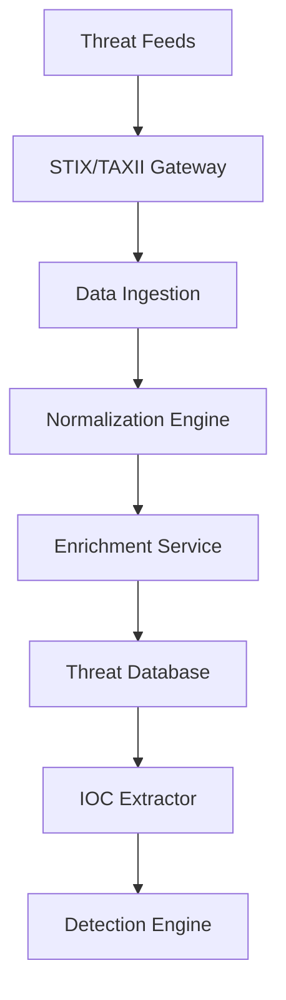
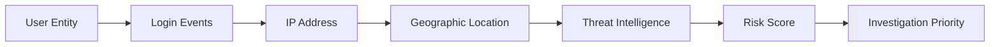
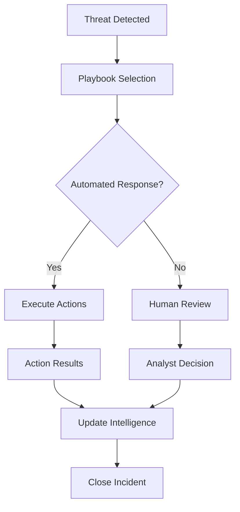

# Zero-Trust Threat Intelligence Platform Design
## Phase 14.1 - Shin AI Platform

## Overview

The Threat Intelligence Platform integrates STIX/TAXII feeds, implements indicator of compromise detection, and provides automated response capabilities through SOAR integration, enabling proactive threat detection and response across the Shin AI Platform.

## System Architecture

### Core Components

#### 1. Threat Intelligence Aggregator (TIA)
**Purpose**: Centralized collection and normalization of threat intelligence feeds

**Key Features**:
- STIX/TAXII 2.1 protocol support
- Multiple feed source integration
- Real-time and batch processing
- Data normalization and enrichment

**Supported Feed Types**:
- **Commercial Feeds**: CrowdStrike, Mandiant, Recorded Future
- **Open Source Feeds**: AlienVault OTX, Abuse.ch, PhishTank
- **Government Feeds**: CISA, FBI, DHS indicators
- **Industry Feeds**: ISAC-specific threat intelligence

**Architecture**:


#### 2. Indicator of Compromise Detection Engine (IOC-DE)
**Purpose**: Real-time detection of known threats and anomalies

**Detection Capabilities**:
- **File-based IOCs**: Hash matching, file signatures
- **Network-based IOCs**: IP addresses, domains, URLs
- **Behavioral IOCs**: Pattern-based anomaly detection
- **AI/ML-based IOCs**: Machine learning model predictions

**Detection Methods**:
```typescript
interface IOCDetection {
  // Hash-based detection
  fileHashDetection(fileHash: string): Promise<IOCMatch[]>;

  // Network-based detection
  networkDetection(indicators: NetworkIndicators): Promise<IOCMatch[]>;

  // Behavioral detection
  behavioralDetection(patterns: BehavioralPatterns): Promise<IOCMatch[]>;

  // Machine learning detection
  mlDetection(features: MLFeatures): Promise<IOCMatch[]>;
}
```

#### 3. Threat Hunting Platform (THP)
**Purpose**: Proactive threat hunting using graph analytics and advanced queries

**Hunting Capabilities**:
- **Graph Analytics**: Entity relationship analysis
- **Timeline Analysis**: Temporal pattern detection
- **Anomaly Hunting**: Statistical outlier detection
- **Correlation Hunting**: Multi-source threat correlation

**Graph Analytics**:


#### 4. Security Orchestration, Automation, and Response (SOAR)
**Purpose**: Automated incident response and playbook execution

**Playbook Categories**:
- **Detection Playbooks**: Automated threat detection workflows
- **Response Playbooks**: Incident response automation
- **Enrichment Playbooks**: Threat intelligence enrichment
- **Notification Playbooks**: Alert and escalation management

**SOAR Workflow**:


### Database Schema Extensions

#### Threat Intelligence Data
```typescript
interface IThreatIntelligence {
  id: string;
  source: string;
  feedType: 'stix' | 'taxii' | 'custom' | 'internal';
  threatType: 'malware' | 'phishing' | 'c2' | 'exploit' | 'campaign';
  indicators: {
    fileHashes: string[];
    ipAddresses: string[];
    domains: string[];
    urls: string[];
    emails: string[];
    registryKeys: string[];
  };
  confidence: number; // 0-100
  severity: 'low' | 'medium' | 'high' | 'critical';
  firstSeen: Date;
  lastSeen: Date;
  validUntil: Date;
  tags: string[];
  metadata: Record<string, any>;
}
```

#### IOC Detection Results
```typescript
interface IIOCDetectionResult {
  id: string;
  organizationId: ObjectId;
  detectionType: 'file' | 'network' | 'behavioral' | 'ml';
  indicator: {
    type: string;
    value: string;
    context: string;
  };
  matchedThreat: {
    threatId: string;
    confidence: number;
    severity: string;
  };
  affectedAssets: {
    type: 'user' | 'service' | 'data' | 'infrastructure';
    id: string;
    name: string;
  }[];
  detectionTimestamp: Date;
  status: 'detected' | 'investigating' | 'confirmed' | 'false_positive' | 'resolved';
  assignedTo?: ObjectId;
  resolution?: string;
}
```

#### Threat Hunting Queries
```typescript
interface IThreatHuntingQuery {
  id: string;
  organizationId: ObjectId;
  name: string;
  queryType: 'graph' | 'timeline' | 'anomaly' | 'correlation';
  parameters: {
    timeRange: TimeRange;
    entities: string[];
    relationships: string[];
    filters: QueryFilter[];
  };
  schedule: {
    type: 'manual' | 'scheduled' | 'continuous';
    cronExpression?: string;
    intervalMinutes?: number;
  };
  results: {
    totalFindings: number;
    highSeverityFindings: number;
    lastRun: Date;
  };
  isActive: boolean;
  createdBy: ObjectId;
}
```

#### SOAR Playbooks
```typescript
interface ISOARPlaybook {
  id: string;
  organizationId: ObjectId;
  name: string;
  description: string;
  triggerConditions: {
    threatTypes: string[];
    severityLevels: string[];
    confidenceThresholds: number[];
    affectedAssets: string[];
  };
  actions: {
    type: 'isolate' | 'block' | 'alert' | 'enrich' | 'escalate';
    parameters: Record<string, any>;
    order: number;
    timeout: number;
  }[];
  approvalRequired: boolean;
  approvalRoles: string[];
  isActive: boolean;
  createdBy: ObjectId;
  usageStats: {
    executions: number;
    successfulExecutions: number;
    averageExecutionTime: number;
  };
}
```

### API Specifications

#### Threat Intelligence API
```typescript
interface ThreatIntelligenceAPI {
  // Get threat indicators
  GET /api/security/threat-intelligence/indicators
  Query: {
    type?: string;
    confidence?: number;
    severity?: string;
    limit?: number;
    offset?: number;
  }

  // Submit custom indicators
  POST /api/security/threat-intelligence/indicators
  {
    indicators: ThreatIndicator[];
    source: string;
    confidence: number;
    metadata: Record<string, any>;
  }

  // Update threat status
  PUT /api/security/threat-intelligence/indicators/:id/status
  {
    status: 'active' | 'inactive' | 'expired';
    reason: string;
  }
}
```

#### IOC Detection API
```typescript
interface IOCDetectionAPI {
  // Scan for IOCs
  POST /api/security/ioc/scan
  {
    scanType: 'file' | 'network' | 'behavioral' | 'comprehensive';
    targets: ScanTarget[];
    scanDepth: 'quick' | 'standard' | 'deep';
  }

  // Get detection results
  GET /api/security/ioc/detections
  Query: {
    organizationId: string;
    status?: string;
    severity?: string;
    dateFrom?: Date;
    dateTo?: Date;
  }

  // Update detection status
  PUT /api/security/ioc/detections/:id
  {
    status: string;
    assignedTo?: string;
    resolution?: string;
    notes?: string;
  }
}
```

#### Threat Hunting API
```typescript
interface ThreatHuntingAPI {
  // Execute hunting query
  POST /api/security/threat-hunting/execute
  {
    queryId: string;
    parameters: Record<string, any>;
  }

  // Get hunting results
  GET /api/security/threat-hunting/results/:queryId
  Response: {
    query: ThreatHuntingQuery;
    results: HuntingResult[];
    summary: ResultSummary;
  }

  // Create hunting query
  POST /api/security/threat-hunting/queries
  {
    name: string;
    queryType: string;
    parameters: QueryParameters;
    schedule: ScheduleConfig;
  }
}
```

#### SOAR API
```typescript
interface SOARAPI {
  // Execute playbook
  POST /api/security/soar/execute
  {
    playbookId: string;
    triggerData: Record<string, any>;
    autoApprove: boolean;
  }

  // Get playbook execution status
  GET /api/security/soar/executions/:executionId
  Response: {
    playbook: SOARPlaybook;
    status: 'running' | 'completed' | 'failed' | 'pending_approval';
    currentStep: number;
    results: ExecutionResult[];
  }

  // Approve playbook execution
  POST /api/security/soar/executions/:executionId/approve
  {
    approvedBy: string;
    comments?: string;
  }
}
```

### Integration Points

#### Existing Security Infrastructure
- **API Security Layer**: IOC detection integration with existing authentication
- **Usage Tracking**: Threat intelligence correlation with usage events
- **Organization Management**: Organization-specific threat intelligence
- **Audit Logging**: Enhanced security event logging

#### External Systems Integration
- **SIEM Integration**: Real-time event forwarding to security monitoring
- **Ticketing Systems**: Automated ticket creation for incidents
- **Communication Platforms**: Alert notifications via Slack, Teams, etc.
- **Cloud Security Services**: Integration with AWS GuardDuty, Azure Sentinel

#### AI/ML Platform Integration
- **Model Protection**: Threat detection for AI model tampering
- **Data Poisoning Detection**: Anomaly detection in training data
- **Adversarial Attack Detection**: Input validation and attack detection
- **Explainability Integration**: Threat intelligence for AI decisions

### Implementation Strategy

#### Phase 1: Foundation (Weeks 1-6)
- STIX/TAXII feed integration
- Basic IOC detection engine
- Threat database schema implementation
- Integration with existing security layer

#### Phase 2: Core Detection (Weeks 7-14)
- Advanced IOC detection algorithms
- Graph-based threat hunting
- Basic SOAR playbook implementation
- Real-time threat correlation

#### Phase 3: Advanced Analytics (Weeks 15-22)
- Machine learning threat detection
- Behavioral analytics integration
- Advanced SOAR automation
- Threat intelligence sharing

#### Phase 4: Optimization (Weeks 23-26)
- Performance optimization
- Advanced ML model training
- Automated threat hunting
- Enterprise integration completion

### Security Considerations

#### Data Protection
- **Indicator Encryption**: Encryption of sensitive threat indicators
- **Access Control**: Role-based access to threat intelligence
- **Data Retention**: Configurable retention policies for threat data
- **Privacy Protection**: Anonymization of personal data in indicators

#### Operational Security
- **Feed Authentication**: Verification of threat feed authenticity
- **Update Integrity**: Validation of threat intelligence updates
- **Audit Logging**: Comprehensive logging of all threat operations
- **Change Management**: Approval workflows for threat intelligence changes

#### Performance and Scalability
- **Distributed Processing**: Horizontal scaling of detection engines
- **Caching Strategy**: Intelligent caching of threat indicators
- **Stream Processing**: Real-time processing of threat events
- **Load Balancing**: Distribution of threat hunting workloads

This Threat Intelligence Platform provides comprehensive threat detection, hunting, and response capabilities, integrating STIX/TAXII feeds with automated SOAR playbooks for proactive security operations.